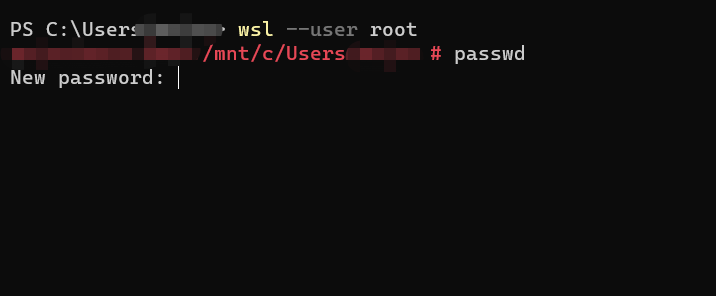

# Reset Windows Subsystem for Linux password

## Steps

1. Use powershell to launch a wsl terminal as root

```ps1
wsl --user root
```

2. Use passwd to create a new password

```bash
passwd
#New password:
```



