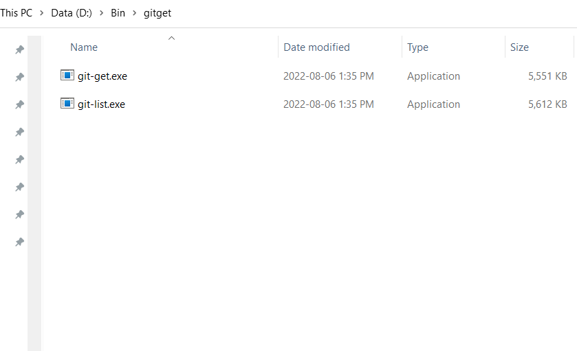

# Use git-get to organize and manage repositories

## Overview

[grdl/git-get](https://github.com/grdl/git-get) is an open-source tool which can organize your repositories. Using git get command, the cloned repositories will be automatically created as directory tree based on repo's URL, owner and name (like golang's go get).

```bash
.
├── dev.azure.com
│   └── smso-azure
│       ├── smso-datacenter
│       ├── smso-measure
│       ├── smso-qna
│       └── smso-saas
├── github.com
│   ├── cepheus-info
│   │   ├── docker-inbound-agent
│   │   ├── dood
│   │   ├── inbound-agent-with-docker
│   │   ├── jenkins-sample-spring-boot
│   │   ├── kubernetes-copy-sample
│   │   ├── read-write-separation-jpa
│   │   ├── read-write-separation-sample
│   │   └── wiki-storage
│   ├── facebook
│   │   └── rocksdb
│   ├── KillerCodeMonkey
│   │   └── ngx-quill-example
│   ├── kubernetes-sigs
│   │   └── nfs-subdir-external-provisioner
│   ├── scriptcamp
│   │   └── kubernetes-jenkins
│   ├── shadowsocks
│   │   └── shadowsocks-rust
│   └── spring-guides
│       └── gs-messaging-stomp-websocket
└── gitlab.sfdapp.com
    ├── smso-org-v2
    │   └── smso-backend
    └── wiki
        ├── architecture
        └── smso-org
```

## Installation

Grab the .zip file from the [latest release](https://github.com/grdl/git-get/releases/) and put the binaries on your PATH.



The Path should be like:


## Configuration

Add below section to your ~/.gitconfig file

```toml
[gitget]
    root = /path/to/my/repos
    host = github.com
    skip-host = false
```

On windows, this should be in the OSDrive:\Users\your-user-name\.gitconfig and the format is:

```toml
[gitget]
    root = D:\\path\to\my\repos
    host = github.com
    skip-host = false
```

## Usage

### Clone repository

```bash
Usage:
  git get <REPO> [flags]

Flags:
  -b, --branch              Branch (or tag) to checkout after cloning.
  -d, --dump                Path to a dump file listing repos to clone. Ignored when <REPO> argument is used.
  -h, --help                Print this help and exit.
  -t, --host                Host to use when <REPO> doesn't have a specified host. (default "github.com")
  -r, --root                Path to repos root where repositories are cloned. (default "~/repositories")
  -c, --scheme              Scheme to use when <REPO> doesn't have a specified scheme. (default "ssh")
  -s, --skip-host           Don't create a directory for host.
  -v, --version             Print version and exit.
```

### List repository

```bash
Usage:
  git list [flags]

Flags:
  -f, --fetch               First fetch from remotes before listing repositories.
  -h, --help                Print this help and exit.
  -o, --out                 Output format. Allowed values: [dump, flat, tree]. (default "tree")
  -r, --root                Path to repos root where repositories are cloned. (default "~/repositories")
  -v, --version             Print version and exit.
```

### Dump repository

```bash
# Use dump format to write all your listed repositories' url to a text file
git list --out dump > repos.dump
```

If you need to dump repositories not in the default ~/repositories url or configured root in .gitconfig, then you can use below command to specify another root location for listing.

```bash
git list --root /home/another/location --out dump > repos.dump
```

### Restore repository based on dump files

```bash
git get --dump /path/to/repos.dump
```

## Conslusion

Use such command line tools will make your workspace clearer. And it's useful when backup multi repositories records as it's just plain URLs.
