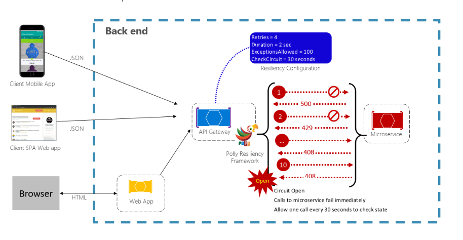

# 工资系统运维优化解决方案

## 1. 概览

本次宕机事件的主要起因是业务量突然升高带来的系统负荷较重，因系统的默认配置无法承担压力引起核心数据库、服务崩溃进而导致系统全面崩溃。

## 2. 方案

### 2.1. 关键服务故障、弹性、容错性 (Key failures, Resilience, Fault tolerance)

| 策略                  | 实践                                                                                              |
| --------------------- | ------------------------------------------------------------------------------------------------- |
| Retry(重试)           | Configures retry operations on designated operations.                                             |
| Circuit Breaker(熔断) | Blocks requested operations for a predefined period when faults exceed a configured threshold     |
| Timeout(超时)         | Places limit on the duration for which a caller can wait for a response.                          |
| BulkHead(隔舱)        | Constrains actions to fixed-size resource pool to prevent failing calls from swamping a resource. |
| Cache(缓存)           | Stores responses automatically.                                                                   |
| Fallback(退路)        | Defines structured behavior upon a failure.                                                       |

分布式应用总是需要处理失败，分布式应用质量好坏的根本在于如何减少和从失败中恢复。

- Retry(重试)

对判定可能会成功的操作进行重试。

- Circuit Breaker(熔断)

对判定基本不可能成功的操作停止调用。

- Timeout(超时)

在有限时间内等待响应。

- BulkHead(隔舱)

对操作划分固定大小的资源池，防止全船沉没。

- Cache(缓存)

自动对结果进行缓存。

- Fallback(退路)

当失败请求发生时，定义一个替代方法，以便调用不再继续占用资源，此时不再对核心服务产生更大的压力，以便一段时间之后能顺利恢复使用。

上述策略是防止核心服务发生无法恢复的故障从而引起雪崩。

文件服务、运维中心、认证服务是系统中的核心服务，当核心服务出现故障时，整个后续的请求均会出现故障并引起大面积不可用的状态。

> 业务系统应当检测到关键服务故障并停止对外提供服务，以便系统能快速尝试恢复。

### 2.2. 配置管理

现场环境存在多达 6 套以上的环境部署，带来极大管理难度，通过手工维护时极易造成错误，给软件运行带来较大损失，因此需要采用 IaC 的方式，将配置管理集中在代码版本之下，同时通过脚本等工具优化每一次部署流程，将实施按开发的要求规范，进行测试以及发布。

### 2.3. 数据检测与修复

现阶段缺少数据检测与修复工具，现场出现的数据问题大多由开发通过手工操作数据库来解决，需要开发相应的运维功能并由运维人员或用户自行完成大部分的修复操作，当用户可以自行修复错误数据时，可以极大减轻公司修复错误数据的负担。

### 2.4. 监控

目前环境监控指标尚不完善，例如只对连接数进行了监控，而系统文件句柄数等指标仍需要持续增加进监控告警之中。而应用服务的 metrics 也应继续接入监控服务。

告警应当配置发送短信通知、邮件通知关键错误至干系人，以便及时处理重要问题和掌握主动。

### 2.5. 日志

排查现场问题依然依赖 docker 容器自带的 json-file logging driver，但是 docker 容器日志会随容器重启清除已释放的日志文件，此时应增加集中管理的日志收集管理工具。较为常见的方案是 EFK(ElasticSearch, Fluentd, Kibana) / ELK(ElasticSearch, Logstash, Kibana).

- 其中 Fluentd 是较为中立的工具，资源占用较小，是 kubernetes / 容器环境中流行的 CNCF 项目。

- Logstash 则是 Elastic 旗下工具，同时基于 Java 开发，相较 Fluentd 需要更多的资源消耗。

### 2.6. Continuous Delivery

1.0 的架构方式为单体应用，且用户规模较小，功能较为简单；2.0 阶段采用了分布式服务架构，具有更强扩展性的同时也带来了更高的复杂度和脆弱性，必须要靠更严谨的设计、测试及服务治理方法才能获得较高的稳定性。

在分布式应用的模型下，2.0 到 3.0 的发展不再是重写，也没有团队能承担重写来完成升级。在此前提下，升级只能通过逐次的重构来完成，业界经过考验的方法是通过 Strangler 模式(扼杀者模式)，即通过外部包装一层原有应用，在不影响功能的前提下，逐次提取出一部分模块进新技术、新设计下的服务当中，最终完成完整的功能替代和升级改造工作。系统原本的一些不能满足健壮性、准确性的设计也都将通过此种方式逐步优化。

对比 1.0 的一整个单体应用，2.0 拥有数 10 个服务和数个外部平台，数 10 倍的用户规模，数 10 个的数据库，同样需要相匹配的设计和工具来提供完备的支撑。

## 3. 数据一致性

### 3.1. 基金数据未删除

此问题在系统运行于高负荷下易出现，主要原因为消息处理不及时或未处理，存在如下表现:

变动记录中已经删除的记录在基金中仍然存在，或变动记录中只有一条的在基金中存在多条。

处理方式为:

1. 非法记录为重复记录，不产生工资金额增减，可直接执行删除记录，并重新生成基金。

2. 非法记录为变动中不存在的记录，且为最后一条，可删除变动花名册、补扣发中该记录后重新计算发放表后生成基金。

3. 非法记录为变动中不存在的记录，且为中间一条，可从变动花名册中以该记录为起始位置删除后续记录，重新完成业务变动，再行生成基金。

综合上述数据处理方式，可提供如下运维功能：

- [ ] 基金花名册、补扣发数据维护 (可执行选择记录并删除)

- [ ] 基金重算 (根据已有花名册、补扣发记录重新核算基金[核定表、发放表、系统补扣发])

- [ ] 事件重放 (从人员错误处理的事件位置开始重新运行处理逻辑，此处理方式依赖于事件记录的正确性，因此需要同时提供基本校验)

### 3.2. 基金数据缺失

此问题在系统在基金服务负载较高时易出现，表现为:

变动记录中已完成该变动，但未生成在基金中。

处理方式为:

1. 基金中包含该记录，但基金月份为空，删除基金后重新生成。

2. 基金中没有该记录，应补全该记录后重新生成。

运维功能中可补充如下项目:

- [ ] 基金花名册维护 (可执行按单位、人员核算并同步花名册)

### 3.3. 其他服务间数据不一致

此问题同样容易在部分服务运行缓慢、崩溃时出现，一般而言可以通过上述运维功能中的[x]事件重放完成处理。

### 3.4. 基础数据维护

因部分业务变动会基于变动前数据产生一条新的历史记录，原程序中采用变动记录 Id 来对变动记录进行排序，有可能导致引用错误的变动前记录。
处理方式为:

手动修改该变动记录为正确值。

- [ ] 通过运维功能开放变动记录编辑 (包含对已审核通过的数据进行编辑，需考虑如何授权及操作日志审计)

### 3.5. 基础数据校验

在完善运维功能后，数据的处理可以较容易进行，但同时也更加依赖基础数据的准确性，如：事件记录、变动记录、变动花名册。应当基于基础数据校验对数据健康度进行评估，分以下维度:

- [x] 事件记录 <-> 变动记录 <-> 变动花名册 三相一致性检查

- [] 当前状态表 <-> 变动记录表; ChangeRecord <-> PersonSnapshot;

- [x] 基金状态

- [ ] 基金状态 <-> 财政状态

前两种均为基础数据校验，后两种为弱一致性校验，均为系统运行过程中需要持续关注质量的数据集。

### 3.6. 其他

有单位反馈出现去年<mark>[2022-11]</mark>审核通过的变动记录被统计进入了新的基金月份<mark>[2023-03]</mark>中。经排查可能原因为:

单位于[2022-11]完成基金审核，变动记录中的基金状态更新为[已通过]状态，但变动花名册中的隐藏字段<mark>[基金状态]</mark>因为某种原因仍旧是<mark>[未通过]</mark>状态。时隔 5 个月之后做新月份基金时，过去的[未通过]变动花名册记录被赋予了新的基金月份[2023-03]。

<mark>[通过基金审核]</mark>对基金服务应该处理为强一致性，对变动花名册的状态更新和基金主记录的状态更新不能部分成功。
