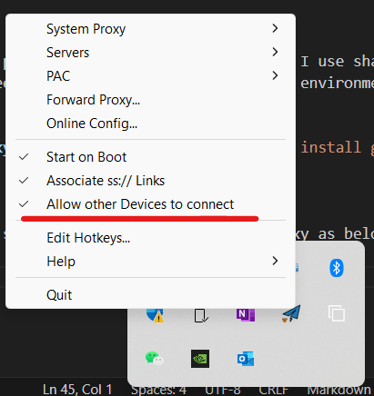

# Use dns challenge to obtain certificate

## 1. Overview

Caddy is a web server that can automatically obtain and renew TLS certificates for your sites. It enables HTTPS by default for all sites, to make your servers more secure.

If port 80, 443 is not available, the only way you can use is `dns challenge` to obtain certificate.

## 2. Walk Through

We have alidns domain, and we want to use caddy to serve our website but without access to port 80, 443.

There is a dns provider plugin for alidns, so we can use `dns challenge` to obtain certificate.

As stated at [https://caddy.community/t/how-to-use-dns-provider-modules-in-caddy-2/8148](https://caddy.community/t/how-to-use-dns-provider-modules-in-caddy-2/8148):

1. We can find your dns provider in [https://github.com/caddy-dns](https://github.com/caddy-dns).

2. And do a xcaddy build to provide the feature as stated here [https://caddyserver.com/docs/build#xcaddy](https://caddyserver.com/docs/build#xcaddy)

> This module does not come with Caddy. It can be added by using xcaddy or our download page. Non-standard modules may be developed by the community and are not officially endorsed or maintained by the Caddy project. The documentation is shown here only as a courtesy.

### 2.1. Install Go on CentOS 7

This is for a custom build of Caddy, which support 3rd party dns provider plugins.

```bash
yum install -y golang
```

### 2.2. Install xcaddy

```bash
go install github.com/caddyserver/xcaddy/cmd/xcaddy@latest
```

> Note: As github cannot be accessed from GFW, we need to use a proxy to access github. Currently I use shadowsocks client on Windows to proxy github. Thus, from another device, you might need to set http_proxy, https_proxy environment variables.

```bash
export http_proxy=http://192.168.2.124:1080 && export https_proxy=http://192.168.2.124:1080 && go install github.com/caddyserver/xcaddy/cmd/xcaddy@latest
```

You may need to turn on the `Allow other devices to connect` to share your shadowsocks client proxy as below:



### 2.3. Add /root/go/bin into PATH

```bash
export PATH=$PATH:/root/go/bin
# add permanently
echo "export PATH=$PATH:/root/go/bin" >> /etc/profile
# alternatively, use bashrc
echo "export PATH=$PATH:/root/go/bin" >> /etc/bashrc
```

### 2.3. Build Caddy with dns providers

```bash
xcaddy build --with github.com/caddy-dns/alidns
```

### 2.4. Prepare your Caddyfile with dns challenge

```Caddyfile
{
    https_port 2143
    acme_dns alidns {
            access_key_id LTAI4Fmj2MaaKQarDmSuePL9
            access_key_secret qDbW70GxLMgUfLlx1OfdpM94furCxW
    }
}

harbor.sfdapp.com {
    reverse_proxy 127.0.0.1:8089
    tls wujuntaocn@outlook.com
}
```

### 2.5. Run Caddy

#### 2.5.1. Run Caddy as an application

```bash
caddy run --config Caddyfile
```

#### 2.5.2. Run Caddy as a service

```bash
cp Caddyfile /etc/caddy/Caddyfile
# Note this caddy binary is built with xcaddy, which support dns challenge
cp caddy /usr/bin/caddy
systemctl enable caddy
systemctl start caddy
```

### 2.6. Redirect to https protocol

Modify your Caddyfile as below

```Caddyfile
{
    https_port 2143
    acme_dns alidns {
            access_key_id your-key-id
            access_key_secret your-key-secret
    }
    servers :2143 {
            name https
            listener_wrappers {
                http_redirect
                tls
            }
    }
}

harbor.sfdapp.com {
    reverse_proxy 127.0.0.1:8089
    tls wujuntaocn@outlook.com
}
```
