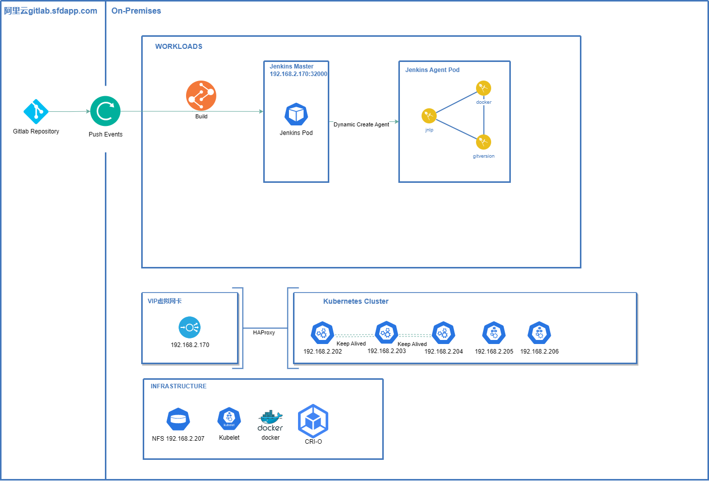
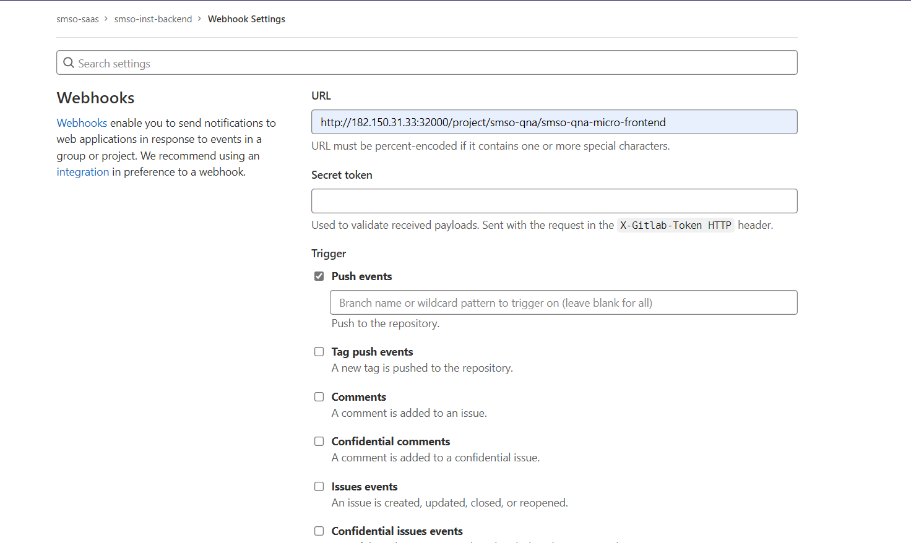

# "Azure DevOps" to "Gitlab + Jenkins" 迁移指南

## 1. 概览

鉴于 Azure DevOps 是微软推出的国际版服务，一直以来存在东南亚服务器网络条件较不稳定、以及目前费用成本较高等问题，公司决定将代码仓库与 CI/CD 迁移至 Gitlab + Jenkins 的免费方案。

| 名称    | 环境     | 内网地址                   | 公网地址                    |
| ------- | -------- | -------------------------- | --------------------------- |
| Gitlab  | 阿里云   | -                          | http://gitlab.sfdapp.com    |
| Jenkins | 公司内网 | http://192.168.2.170:32000 | http://182.150.31.33:32000/ |

> 注意: gitlab 地址使用 https，遇到了 jenkins master 容器中无法 clone 部分仓库的问题如下，因此目前暂时使用 http。后续需排查该错误的详细原因，考虑尝试升级 jenkins master built-in node 中使用的 git client (实际可能 jenkins inbound agent 中同样存在此问题)。

```bash
$ git clone https://gitlab.sfdapp.com/smso-infrastructure/smso-measure-test-ci.git
Cloning into 'smso-measure-test-ci'...
Username for 'https://gitlab.sfdapp.com': xxx
Password for 'https://xxx@gitlab.sfdapp.com':
error: RPC failed; curl 56 GnuTLS recv error (-110): The TLS connection was non-properly terminated.
```

## 2. CI/CD 架构

> 注意: 192.168.2.170 地址是 kubernetes 集群创建的 Virtual IP，通过 KeepAlived + HAProxy 起到负载均衡的作用，实际的 kubernetes 集群环境如下所示:

> 同时需要注意：VIP 所使用的端口是 6443(即 kubernetes api server 的默认端口)，但 master 节点 IP 此处更换端口为 6444 以防止端口绑定冲突。详细说明参见 [Kubernetes HA Clusters#4.1.2 Stacked Loadbalancer](../kubernetes/kubernetes-ha-clusters.md#412-stacked-loadbalancer)



| 名称    | 节点       | 内网地址      | 备注                                     |
| ------- | ---------- | ------------- | ---------------------------------------- |
| VIP     | 虚拟 IP    | 192.168.2.170 | :6443 kubernetes api server 负载均衡端口 |
| node202 | master1    | 192.168.2.202 | :6444 kubernetes api server              |
| node203 | master2    | 192.168.2.203 | :6444 kubernetes api server              |
| node204 | master3    | 192.168.2.204 | :6444 kubernetes api server              |
| node205 | worker1    | 192.168.2.205 | role: worker                             |
| node206 | worker2    | 192.168.2.206 | role: worker                             |
| nfs207  | NFS Server | 192.168.2.207 | /home/share                              |

## 3. 迁移步骤

### 3.0 kubernetes 集群的搭建与 Jenkins 准备工作

_此部分请参考如下文档以及 kubernetes 官方文档, 本文不再赘述。_

- [Kubernetes HA Clusters](../kubernetes/kubernetes-ha-clusters.md)
- [Kubernetes HA Clusters Hands-on](../kubernetes/kubernetes-ha-clusters-hands-on.md)
- [Use NFS As Storage Class](../kubernetes/use-nfs-as-storage-class.md)
- [Jenkins Agent Deployment](./jenkins-agent-deployment.md)

Reference Concept:

> A Pod

A Pod(as in a pod of whales or pea pod) is a group of one or more containers, with shared storage and network resources, and a specification for how to run the containers.

> Container Runtime & Engines

| Name       | Remark                                                           | Type                       |
| ---------- | ---------------------------------------------------------------- | -------------------------- |
| Containerd | Docker 使用的底层 Runtime                                        | Runtime                    |
| CRI-O      | Kubernetes CRI (Container Runtime Interface)                     | Runtime                    |
| Runc       | containerd uses runc to do all the linux work                    | Runtime                    |
| Docker     | open platform for developing, shipping, and running applications | Platform                   |
| Podman     | the POD manager                                                  | OCI Image Management tools |
| Buildah    | command-line alt to writing Dockerfiles                          | -                          |
| Buildkit   | an optimized rewrite of Docker's build engine                    | -                          |
| crictl     | command-line interface for CRI-compatible container runtimes     | Debug tools                |

> Docker vs Podman comparasion

| Comaparasion Item                    | Docker | Podman |
| ------------------------------------ | ------ | ------ |
| Runs on a daemon                     | ✅     | 🚫     |
| Daemon-less                          | 🚫     | ✅     |
| Can run containers run as root       | ✅     | ✅     |
| Can run containers as non-root users | 🚫     | ✅     |
| Monolithic application               | ✅     | 🚫     |
| Can build container images           | ✅     | 🚫     |
| Supports docker-compose              | ✅     | ✅     |
| Supports docker-swarm                | ✅     | 🚫     |

> Kubelet、Kubectl、Kubeadm

| Name    | Remark                                                                                               | Type    |
| ------- | ---------------------------------------------------------------------------------------------------- | ------- |
| Kubelet | the primary "node agent" that runs on each node                                                      | Service |
| Kubectl | command-line tool allows you to run commands against Kubernetes clusters                             | Command |
| Kubeadm | provide kubeadm init and kubeadm join as best-practice "fast paths" for creating Kubernetes clusters | Command |

### 3.1 迁移代码仓库

_执行位置: 本地 PC & Gitlab UI_

```bash
# 1. 清理远端仓库，例如: 删除不必要的远端分支, 包括已合并过的release分支等
# 2. 克隆本地仓库
git clone https://smso-azure@dev.azure.com/smso-azure/smso-saas/_git/smso-auth-backend
# 3. 创建本地tracking分支
for i in `git branch -a | grep remote | grep -v HEAD | grep -v master`; do git branch --track ${i#remotes/origin/} $i; done
# 4. 在gitlab上的合适位置创建工程
# 5. 推送至远端分支
git remote rename origin old-origin
git remote add origin http://gitlab.sfdapp.com/smso-saas/smso-auth-backend.git
git push -u origin --all
git push -u origin --tags
```

### 3.2 准备 Jenkinsfile

_执行位置: 本地 PC_

将调整后的 [pod.yaml](./templates/pod.yaml) 与 [Jenkinsfile](./templates/Jenkinsfile) 复制进当前待迁移工程中。

> 注意: 此处以后端使用的配置文件为例说明，前端应当使用 templates/下的另外版本

> pod.yaml

```yaml
apiVersion: v1
kind: Pod
spec:
  containers:
    # container jnlp is for the jenkins agent container
    - name: jnlp
      image: jenkins/inbound-agent:4.10-3
      imagePullPolicy: IfNotPresent
      volumeMounts:
        # jenkins-repos for reference repository
        - name: jenkins-repos
          mountPath: /home/jenkins/repos
        # jenkins-gradle for gradle build cache
        - name: jenkins-gradle
          mountPath: /home/jenkins/.gradle
          # As gradle cannot run parallel, we must use a different .gradleHome for each project via subPath
          subPath: project-name
      resources:
        requests:
          cpu: 1000m
          memory: 4096Mi
        limits:
          cpu: 1000m
          memory: 4096Mi
      workingDir: /home/jenkins/agent
    # container gitversion for SemVer
    - name: gitversion
      image: gittools/gitversion:5.11.1-alpine.3.13-6.0
      imagePullPolicy: IfNotPresent
      command:
        - "sleep"
      args:
        - "99d"
      volumeMounts:
        - name: jenkins-repos
          mountPath: /home/jenkins/repos
      resources:
        limits:
          cpu: 500m
          memory: 512Mi
    # container docker for build & push image
    - name: docker
      image: docker:latest
      imagePullPolicy: IfNotPresent
      command:
        - sleep
      args:
        - "99d"
      tty: true
      volumeMounts:
        # docker.sock for sharing host's docker engine
        - name: docker-sock
          mountPath: /var/run/docker.sock
      resources:
        limits:
          cpu: 500m
          memory: 512Mi
  volumes:
    - name: jenkins-repos
      persistentVolumeClaim:
        claimName: jenkins-repos-pv-claim
    - name: jenkins-gradle
      persistentVolumeClaim:
        claimName: jenkins-gradle-pv-claim
    - name: docker-sock
      hostPath:
        path: /var/run/docker.sock
```

> Jenkinsfile

以下 Jenkinsfile 使用的是 Scripted pipeline 的语法，应当与 Declarative pipeline 的语法区分开来。可浏览 Jenkins 官方文档了解更多语法相关特点。

也可查看 [http://your_jenkins_url/pipeline-syntax](http://192.168.2.170:32000/pipeline-syntax) 以生成 Pipeline Steps 供参考。

```groovy
/* groovylint-disable-next-line CompileStatic */
String version

// use kubernetes podTemplate
podTemplate(
    yaml: readTrusted(path: 'pod.yaml'),
    workspaceVolume: persistentVolumeClaimWorkspaceVolume(claimName: 'jenkins-workspace-pv-claim', readOnly: false)
) {
    node(POD_LABEL) {
        stage('Checkout') {
            echo '========Executing Checkout========'

            checkout scm

            always {
                echo '========Checkout finished========'
            }
        }

        stage('Gitversion') {
            echo '========Git version========'
            container('gitversion') {
                /* groovylint-disable-next-line LineLength */
                version = sh(
                    script:'/tools/dotnet-gitversion /showvariable InformationalVersion',
                    returnStdout: true
                ).trim()
            }

            echo "========Version: ${version}========"
            currentBuild.displayName = "#${env.BUILD_ID} v${version}"
        }

        stage('Build') {
            withGradle {
                sh 'chmod a+x gradlew'
                sh './gradlew build -x test'
            }

            always {
                echo '========Gradle build finished========'
            }
            onFailure {
                echo '========Gradle build execution failed========'
            }
        }

        stage('Bake Docker image') {
            container('docker') {
                echo '========docker-compose========'
                /* groovylint-disable-next-line GStringExpressionWithinString */
                // sh 'curl -XPOST -v --unix-socket /var/run/docker.sock http://localhost/build'
                // sh 'docker build -t cepheus990910/jenkins-sample-spring-boot:${env.BUILD_ID} .'
                docker.withRegistry('', 'cepheus990910') {
                    // customImage = docker.build("cepheus990910/jenkins-sample-spring-boot:${version}")
                    // customImage.push()
                    sh "export APP_VERSION=${version} \
                       && docker compose -f docker-compose.yml build \
                       && docker compose -f docker-compose.yml push"
                }
            }
        }
    }
}

```

### 3.3 准备 reference repository

_执行位置: NFS 服务器_

Reference repository 是一个 git 仓库的镜像仓库，可帮助克隆代码时加速网络访问。此步骤将在 NFS 服务器中创建 git 镜像仓库，并在 [3.4 创建 Multi branch pipeline](#34-创建-multi-branch-pipeline) 中配置使用。

登入 NFS207 服务器，在 jenkins-repos-pv-claim 下 mirror clone 对应工程的代码。

> 注意: 如果忘记为 gitversion 容器挂载 reference repository 目录，gitversion 命令将会报错。例如，镜像仓库被删除后，在本地仓库中运行 gitversion 命令将抛出异常。

```bash
# jenkins-repos是jnlp, gitversion容器中均需要访问到的pvc，原因是git scm拉取步骤和gitversion计算步骤都需要reference repository实际可访问才能工作
cd /home/share/kubernetes/devops-tools-jenkins-repos-pv-claim/
# mirror clone是一种将仓库用作纯镜像的方式，不会检出work tree
git clone --mirror http://gitlab.sfdapp.com/smso-saas/smso-auth-backend.git
# mirror clone 的代码可以不定期通过以下命令更新
git remote update
```

> 以下是 reference clone 的命令 (供参考，不需要执行)

```bash
# 使用reference clone选项可以加速拉取代码的过程，镜像仓库已有的内容不需要再次产生网络访问
git clone --reference /home/jenkins/repos/smso-auth-backend.git http://gitlab.sfdapp.com/smso-saas/smso-auth-backend.git --dissociate
# 注意dissociate命令会完整展开镜像仓库的引用至本地，即不再与reference repository有关联，但Jenkins的git scm步骤没有提供该选项，所以仍然需要采用挂载jenkins-repos目录的方式使reference repository可访问
```

> 注意: jenkins-repos-pv-claim 是在 pod.yaml 中指定创建且使用 nfs-provisioner，因此需在创建 nfs-client storage class 时指定名称创建的 pathPattern，见 [Use NFS as Storage Class](../kubernetes/use-nfs-as-storage-class.md#deploying-your-storage-class)。否则目录创建时会动态生成名称 uuid，给灾难恢复、文件夹维护等过程带来不便。

```bash
# 动态创建的名称如下
/home/share/kubernetes/devops-tools-jenkins-repos-pv-claim-pvc-4d8999cc-1339-41ae-b8cd-ef78598f4a9d
# 使用pathPattern创建的名称如下
/home/share/kubernetes/devops-tools-jenkins-repos-pv-claim
```

### 3.4 创建 Multi-branch pipeline

_执行位置：Jenkins UI_

在 Jenkins UI 中，选择 New-Item 并使用 Multi-branch pipeline 的方式创建 Build Configuration。

- 需注意使用 Filter by Name (Regular Expression) 来过滤需要 Build 的分支。

  ```bash
  ^main|master|release/.*|hotfix/.*|develop$
  ```

- 需注意添加 Advanced clone behaviours -> Path of the reference repo to use during clone 来指定 Reference Repository

  此示例中为：/home/jenkins/repos/smso-auth-backend.git，请结合以下摘要的 volumes / volumeMounts 配置理解该路径的绑定位置。

  volumes 中的 jenkins-repos-pv-claim 是在 [Jenkins Agent Deployment](./jenkins-agent-deployment.md#3-create-volume) 一文中提前创建的，[resources/](./resources/) 目录中有 pvc volume.yaml 文件。

  ```yaml
  apiVersion: v1
  kind: Pod
  spec:
    containers:
      # container jnlp is for the jenkins agent container
      - name: jnlp
        volumeMounts:
          # jenkins-repos for reference repository
          - name: jenkins-repos
            mountPath: /home/jenkins/repos
    volumes:
      - name: jenkins-repos
        persistentVolumeClaim:
          claimName: jenkins-repos-pv-claim
  ```

- Build Configuration 使用的是 by Jenkinsfile，即代码仓库中扫描到的 Jenkinsfile 文件，默认使用 root 路径

### 3.5 添加 Gitlab Webhook

_执行位置: Gitlab UI_

Gitlab 中的 Integration 方式无法在目前的版本中工作，主要原因是新版本 Jenkins 服务器的安全策略限制，需要提供 CSRF token 防护，而 Gitlab 的集成方式未提供。

因此我们应当使用 Webhook 的方式来添加对 Push Events 的通知。

> 注意: 因为架构方式为代码仓库托管于外网，构建服务器部署于内网，所以需要对 Jenkins Url 做可供外网访问的虚拟服务器映射。请注意访问安全性，包括但不限于访问控制。

```bash
http://182.150.31.33:32000/ <-> http://192.168.2.170:32000/
```

| Webhook URL                                                         | 备注                         |
| ------------------------------------------------------------------- | ---------------------------- |
| http://182.150.31.33:32000/project/smso-qna/smso-qna-micro-frontend | /project/group/pipeline-name |

[-] 注意去掉勾选 Enable SSL verification 选项



## 4. 结论

Azure DevOps 迁移至 Jenkins 的主要难度在于各个环节的逻辑需要自行理解清楚。

对 Kubernetes 基本原理的掌握、Git 的工作方式、Jenkins master 与 Jenkins Agent 的关系，以及对 Jenkins pipeline 语法的掌握，都是较为独立的知识体系，开发人员与运维人员均需要对其技术实质有一个较为清晰全面的认识。
