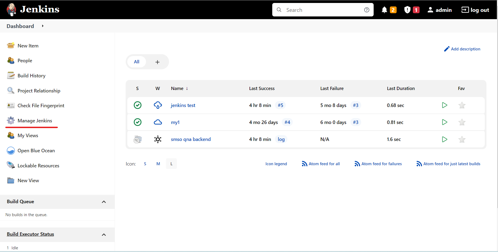
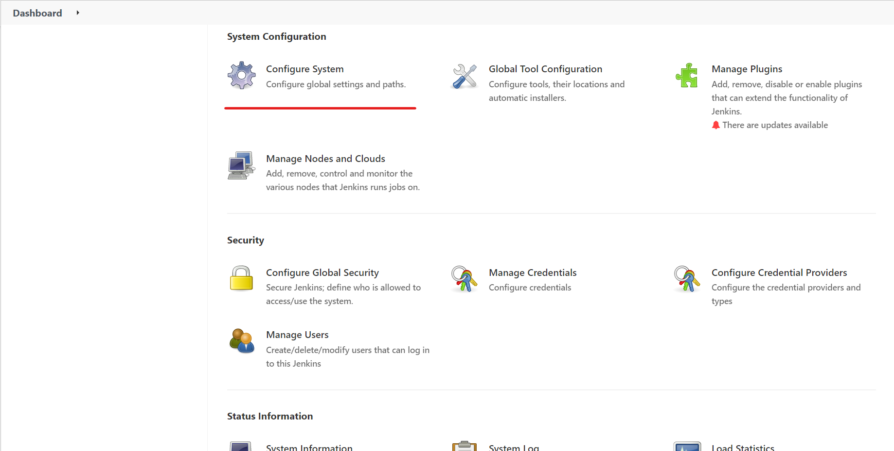
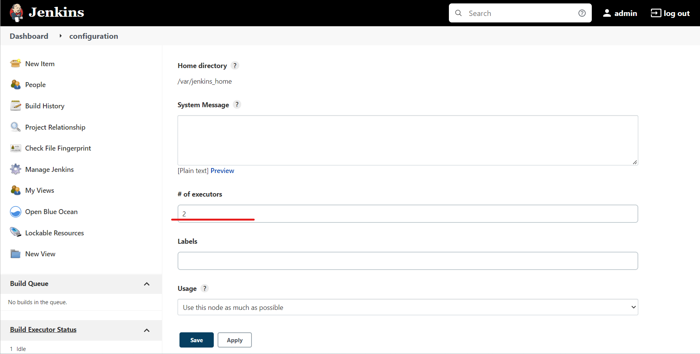
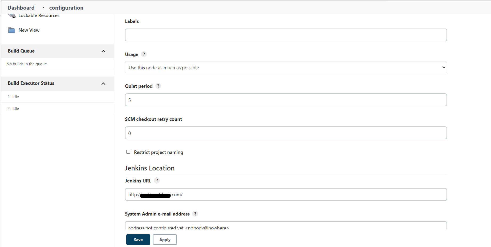
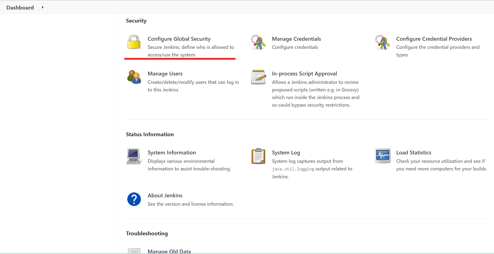
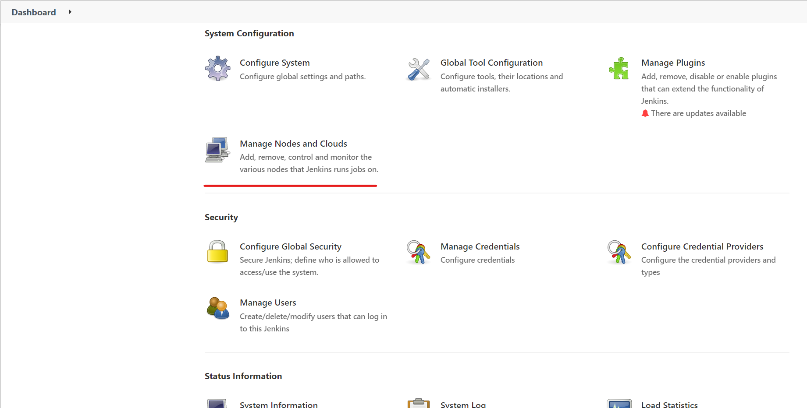

# Deploy a jenkins agent pool to a kubernetes cluster

## Overview

This is a template for a jenkins agent pool deployment.

Hosting Jenkins on a Kubernetes Cluster is beneficial for Kubernetes-based deployments and dynamic container-based scalable Jenkins agents.

## Prerequisites

- Working installation of a Jenkins controller installation, the controller is referred to as the master node.
- Any supported Windows OS installation which will be referred to as the Jenkins agent node.
- A kubernetes cluster

## Design Specification

- Jenkins master running inside the Kubernetes cluster.
- Jenkins master running outside the Kubernetes cluster.

We will look at both scenarios and their configurations.

## Installation

### Prepare Manifests files

```bash
git clone https://github.com/scriptcamp/kubernetes-jenkins
```

File structure is as below:

```bash
.
└── kubernetes-jenkins
    ├── deployment.yaml
    ├── namespace.yaml
    ├── README.md
    ├── serviceAccount.yaml
    ├── service.yaml
    └── volume.yaml
```

### 1. Create namespace

```bash
kubectl apply -f namespace.yaml
# This can also be achieved by below command:
# kubectl create namespace devops-tools
```

### 2. Create Service Account

```yaml
---
apiVersion: rbac.authorization.k8s.io/v1
kind: ClusterRole
metadata:
  name: jenkins-admin
rules:
  - apiGroups: [""]
    resources: ["*"]
    verbs: ["*"]

---
apiVersion: v1
kind: ServiceAccount
metadata:
  name: jenkins-admin
  namespace: devops-tools

---
apiVersion: rbac.authorization.k8s.io/v1
kind: ClusterRoleBinding
metadata:
  name: jenkins-admin
roleRef:
  apiGroup: rbac.authorization.k8s.io
  kind: ClusterRole
  name: jenkins-admin
subjects:
  - kind: ServiceAccount
    name: jenkins-admin
    namespace: devops-tools
```

```bash
# Execute command to create serviceAccount
kubectl apply -f serviceAccount.yaml
```

### 3. Create volume

Create 'volume.yaml' and copy the following persistent volume manifest. Note you should change PersistentVolume.spec.nodeAffinity.required.nodeSelectorTerms.matchExpressions.values respectfully.

```yaml
kind: StorageClass
apiVersion: storage.k8s.io/v1
metadata:
  name: local-storage
provisioner: kubernetes.io/no-provisioner
volumeBindingMode: WaitForFirstConsumer

---
apiVersion: v1
kind: PersistentVolume
metadata:
  name: jenkins-pv-volume
  labels:
    type: local
spec:
  storageClassName: local-storage
  claimRef:
    name: jenkins-pv-claim
    namespace: devops-tools
  capacity:
    storage: 10Gi
  accessModes:
    - ReadWriteOnce
  local:
    path: /mnt
  nodeAffinity:
    required:
      nodeSelectorTerms:
        - matchExpressions:
            - key: kubernetes.io/hostname
              operator: In
              values:
                - worker-node01

---
apiVersion: v1
kind: PersistentVolumeClaim
metadata:
  name: jenkins-pv-claim
  namespace: devops-tools
spec:
  storageClassName: local-storage
  accessModes:
    - ReadWriteOnce
  resources:
    requests:
      storage: 3Gi
```

If we're using nfs as storage class, use below config for pvc:

```yaml
apiVersion: v1
kind: PersistentVolumeClaim
metadata:
  name: jenkins-pv-claim
  namespace: devops-tools
spec:
  storageClassName: nfs-client
  accessModes:
    - ReadWriteOnce
  resources:
    requests:
      storage: 3Gi
```

```bash
# Execute command to create volume
kubectl apply -f volume.yaml
```

### 4. Create Deployment

```yaml
apiVersion: apps/v1
kind: Deployment
metadata:
  name: jenkins
  namespace: devops-tools
spec:
  replicas: 1
  selector:
    matchLabels:
      app: jenkins-server
  template:
    metadata:
      labels:
        app: jenkins-server
    spec:
      securityContext:
        fsGroup: 1000
        runAsUser: 1000
      serviceAccountName: jenkins-admin
      containers:
        - name: jenkins
          image: jenkins/jenkins:lts
          resources:
            limits:
              memory: "2Gi"
              cpu: "1000m"
            requests:
              memory: "500Mi"
              cpu: "500m"
          ports:
            - name: httpport
              containerPort: 8080
            - name: jnlpport
              containerPort: 50000
          livenessProbe:
            httpGet:
              path: "/login"
              port: 8080
            initialDelaySeconds: 90
            periodSeconds: 10
            timeoutSeconds: 5
            failureThreshold: 5
          readinessProbe:
            httpGet:
              path: "/login"
              port: 8080
            initialDelaySeconds: 60
            periodSeconds: 10
            timeoutSeconds: 5
            failureThreshold: 3
          volumeMounts:
            - name: jenkins-data
              mountPath: /var/jenkins_home
      volumes:
        - name: jenkins-data
          persistentVolumeClaim:
            claimName: jenkins-pv-claim
```

```bash
# Execute command to create deployment
kubectl apply -f deployment.yaml
# Check the deployment status
kubectl get deployments -n devops-tools
# Describe details
kubectl describe deployments --namespace=devops-tools
```

### 5. Create service for outside world

```yaml
apiVersion: v1
kind: Service
metadata:
  name: jenkins-service
  namespace: devops-tools
  annotations:
    prometheus.io/scrape: "true"
    prometheus.io/path: /
    prometheus.io/port: "8080"
spec:
  selector:
    app: jenkins-server
  type: NodePort
  ports:
    - port: 8080
      name: ui
      targetPort: 8080
      nodePort: 32000
    - port: 32500
      name: inbound
      targetPort: 32500
      nodePort: 32500
```

Note that it's important to include the inbound tcp port as we need to access this port in jenkins agent.

```bash
# Execute command to create service
kubectl apply -f service.yaml
```

Now you can access the jenkins dashboard via http://<Node-IP>:32000

### Remove default agent from jenkins master node

- Login to jenkins master

- Go to Manage Jenkins -> Configure System

  

  

- Change the number of executors to 0

  

- Ensure jenkins url is set correctly

  

- Save the configuration

### Setting the TCP Port for Inbound Agents

- Go to Manage Jenkins -> Configure Global Security

  

- Enable the TCP port for inbound agents
  - [x] Fixed 32500

### Install jenkins plugins

| name              | description                                        |
| ----------------- | -------------------------------------------------- |
| Kubernetes plugin | Use this plugin for kubernetes scaling             |
| GitLab Plugin     | Gitlab plugin for webhooks                         |
| Docker Pipeline   | Use this plugin for invoke docker in your pipeline |

### Create a new agent pool

- Go to Manage Jenkins -> Manage Nodes and Clouds -> Configure Clouds
  

- Click on Add a new cloud

> Kubernetes Cloud details

| name                 | config                                                     | description                            |
| -------------------- | ---------------------------------------------------------- | -------------------------------------- |
| Kubernetes URL       | https://192.168.2.170:6443                                 | -                                      |
| Kubernetes Namespace | devops-tools                                               | -                                      |
| Jenkins URL          | http://jenkins-service.devops-tools.svc.cluster.local:8080 | Not used                               |
| [x]Direct Connection | true                                                       | Use this option instead of Jenkins URL |

> Pod Template details

| name      | config        | description |
| --------- | ------------- | ----------- |
| Name      | jenkins-agent | -           |
| Namespace | devops-tools  | -           |
| Labels    | jenkins-agent | -           |

> Container Template

| name         | config                       | description |
| ------------ | ---------------------------- | ----------- |
| Docker image | jenkins/inbound-agent:4.10-3 | -           |

### Refine Jenkinsfile & pod.yaml

As we are using kubernetes to create jenkins agent, we need to make use of Jenkinsfile & pod.yaml in templates/.

> pod.yaml

In pod.yaml, we defined a volume which sharing the host machine's /var/run/docker.sock. That means the docker daemon will be kept the same.

```yaml
apiVersion: v1
kind: Pod
spec:
  containers:
    # container jnlp is for the jenkins agent container
    - name: jnlp
      image: jenkins/inbound-agent:4.10-3
      imagePullPolicy: IfNotPresent
      volumeMounts:
        # jenkins-repos for reference repository
        - name: jenkins-repos
          mountPath: /home/jenkins/repos
        # jenkins-gradle for gradle build cache
        - name: jenkins-gradle
          mountPath: /home/jenkins/.gradle
          # As gradle cannot run parallel, we must use a different .gradleHome for each project via subPath
          subPath: project-name
      resources:
        requests:
          cpu: 1000m
          memory: 4096Mi
        limits:
          cpu: 1000m
          memory: 4096Mi
      workingDir: /home/jenkins/agent
    # container gitversion for SemVer
    - name: gitversion
      image: gittools/gitversion:5.11.1-alpine.3.13-6.0
      imagePullPolicy: IfNotPresent
      command:
        - "sleep"
      args:
        - "99d"
      volumeMounts:
        - name: jenkins-repos
          mountPath: /home/jenkins/repos
      resources:
        limits:
          cpu: 500m
          memory: 512Mi
    # container docker for build & push image
    - name: docker
      image: docker:latest
      imagePullPolicy: IfNotPresent
      command:
        - sleep
      args:
        - "99d"
      tty: true
      volumeMounts:
        # docker.sock for sharing host's docker engine
        - name: docker-sock
          mountPath: /var/run/docker.sock
      resources:
        limits:
          cpu: 500m
          memory: 512Mi
  volumes:
    - name: jenkins-repos
      persistentVolumeClaim:
        claimName: jenkins-repos-pv-claim
    - name: jenkins-gradle
      persistentVolumeClaim:
        claimName: jenkins-gradle-pv-claim
    - name: docker-sock
      hostPath:
        path: /var/run/docker.sock
```

> Jenkinsfile

Below Jenkinsfile demonstrate the minimal use case of jenkins pipeline that will checkout, gradle build, docker build, & docker push to remote image repository.

```groovy
/* groovylint-disable-next-line CompileStatic */
String version

// use kubernetes podTemplate
podTemplate(
    yaml: readTrusted(path: 'pod.yaml'),
    workspaceVolume: persistentVolumeClaimWorkspaceVolume(claimName: 'jenkins-workspace-pv-claim', readOnly: false)
) {
    node(POD_LABEL) {
        stage('Checkout') {
            echo '========Executing Checkout========'

            checkout scm

            always {
                echo '========Checkout finished========'
            }
        }

        stage('Gitversion') {
            echo '========Git version========'
            container('gitversion') {
                /* groovylint-disable-next-line LineLength */
                version = sh(
                    script:'/tools/dotnet-gitversion /showvariable InformationalVersion',
                    returnStdout: true
                ).trim()
            }

            echo "========Version: ${version}========"
            currentBuild.displayName = "#${env.BUILD_ID} v${version}"
        }

        stage('Build') {
            withGradle {
                sh 'chmod a+x gradlew'
                sh './gradlew build -x test'
            }

            always {
                echo '========Gradle build finished========'
            }
            onFailure {
                echo '========Gradle build execution failed========'
            }
        }

        stage('Bake Docker image') {
            container('docker') {
                echo '========docker-compose========'
                /* groovylint-disable-next-line GStringExpressionWithinString */
                // sh 'curl -XPOST -v --unix-socket /var/run/docker.sock http://localhost/build'
                // sh 'docker build -t cepheus990910/jenkins-sample-spring-boot:${env.BUILD_ID} .'
                docker.withRegistry('', 'cepheus990910') {
                    // customImage = docker.build("cepheus990910/jenkins-sample-spring-boot:${version}")
                    // customImage.push()
                    sh "export APP_VERSION=${version} \
                       && docker compose -f docker-compose.yml build \
                       && docker compose -f docker-compose.yml push"
                }
            }
        }
    }
}
```

### Prepare common PersistentVolumeClaims for jenkins agent

Note that our pod.yaml uses some common pvcs like "jenkins-repos-pv-claim", "jenkins-workspace-pv-claim", "jenkins-gradle-pv-claim", etc. We should create those resources before any pipeline creation.

Use below yaml files for pvc creation

- [jenkins-gradle/volume.yaml](./resources/jenkins-gradle/volume.yaml)
- [jenkins-repos/volume.yaml](./resources/jenkins-repos/volume.yaml)
- [jenkins-workspace/volume.yaml](./resources/jenkins-workspace/volume.yaml)
