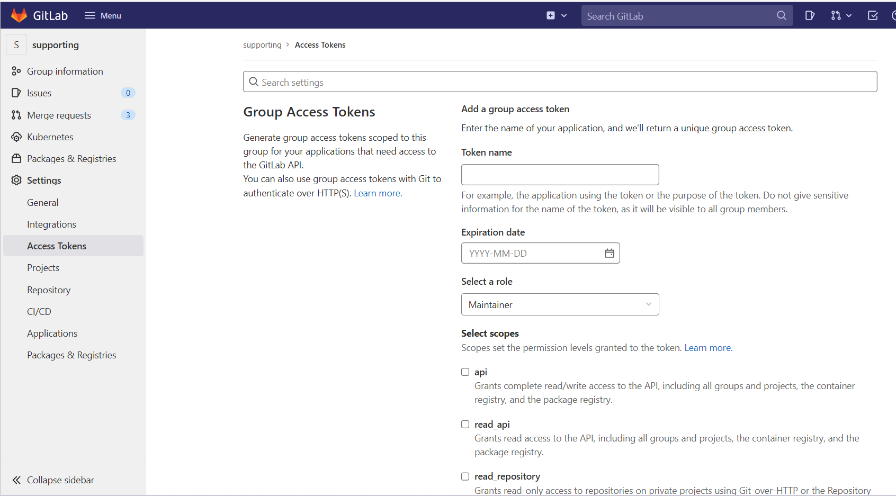

# Resolve Webhooks 500 error after gitlab restore

## 1. Overview

After gitlab restore, we've encountered an error that cannot access webhooks.

## 2. Solution

### 2.1 Find Webhook Ids in gitlab-psql

Enter gitlab container use docker exec

```bash
docker exec -it your-container-id /bin/bash
gitlab-psql
```

Find project_ids and webhook ids with sql

```sql
select project_id, id from web_hooks;
```

### 2.2 Use api to DELETE broken webhooks

1. Find Access Token

Navigate to Gitlab UI -> Your Group, Choose Settings -> Access Tokens in submenu.

Create your access token and copy to use later.



2. Use curl to send DELETE request

```bash
curl --header "Private-Token: your-access-token" -X DELETE http://your-domain/api/v4/projects/<your-project-id>/hooks/<your-hook-id>
```
