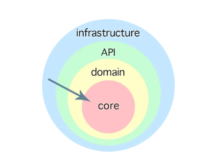

# Domain Optimization

## Architectural Considerations

- High-Level Architecture

领域与领域之间的关系

- Mid-Level Architecture

领域内部的模型设计，事件模型

- Low-Level Architecture

Technical Design

## Domain-Driven Design

### Clean Architecture, Onion Architecture

- Core

核心业务逻辑，领域模型

- Domain

领域服务，领域事件

- Application / API

应用服务 / API

- Infrastructure

基础设施，数据库，消息队列，缓存，文件系统，外部服务
