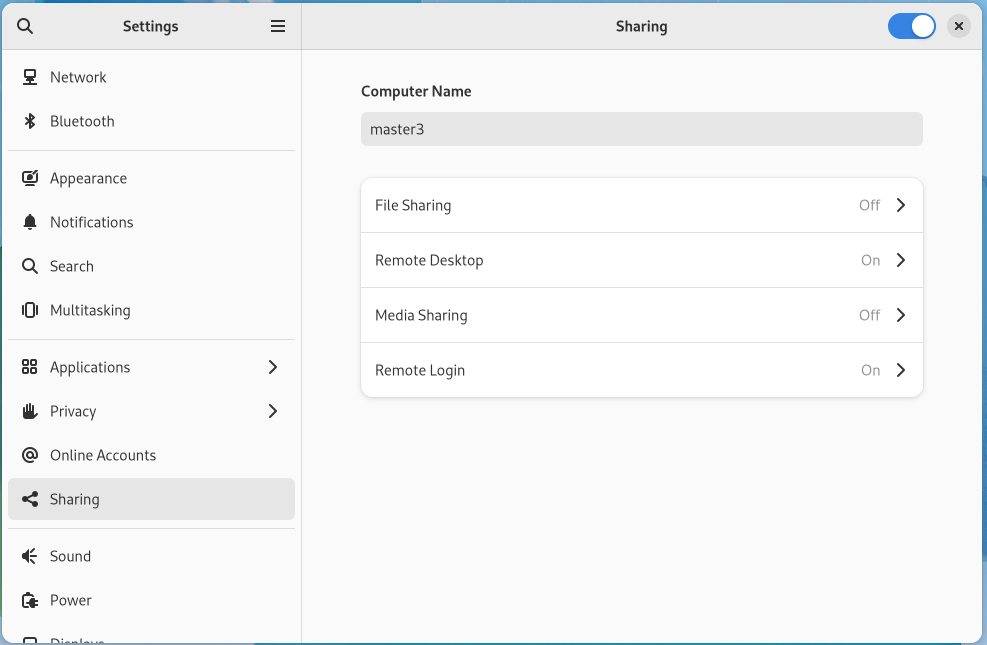
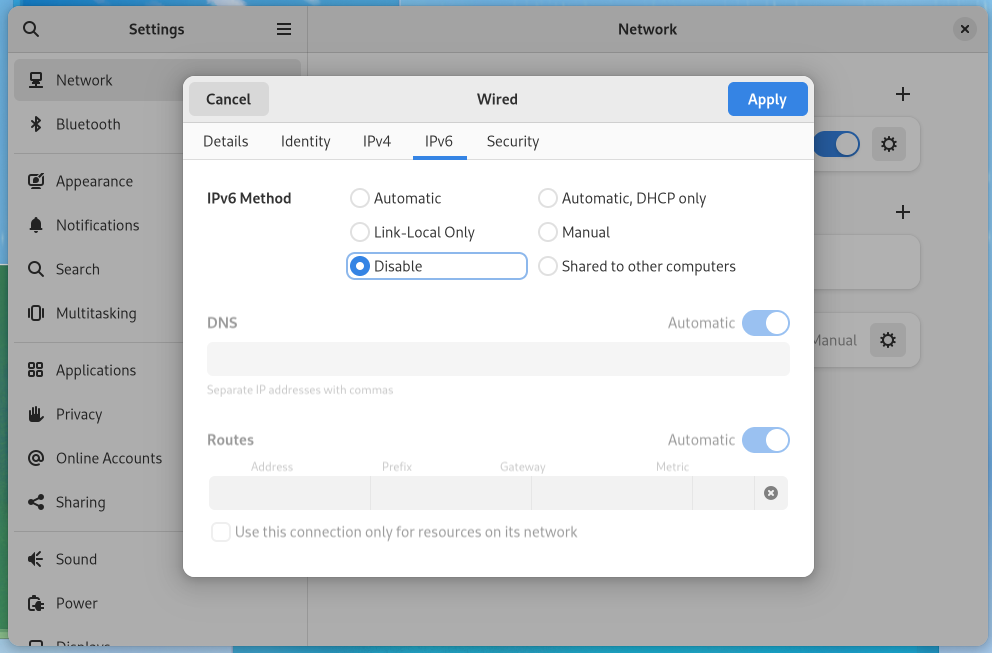

# Kubernetes Highly Available Clusters Hands-On

## 1. Overview

This is a step by step guide to setup Kubernetes Highly Available Clusters. We will setup a Kubernetes cluster with stacked control plane nodes. This approach requires less infrastructure. The etcd members and control plane nodes are co-located.

## 2. Prepare the host machines

- An OpenSUSE Tumbleweed machine with a hostname master1, also tried Alpine Linux for a minimal host environment. See [Install Alpine Linux on VMware](install-alpine-linux-on-vmware.md) for more information.
- An Ubuntu 22.04 machine with a hostname master2.
- A Fedora 36 machine with a hostname master3.

I choose 3 different distributions to demonstrate that Kubernetes can be installed on any Linux distribution.

```bash
# set hostname to master1
sudo hostnamectl hostname master1
```

Change the hostname in the `/etc/hosts` file.

```bash
# add hostname to /etc/hosts
127.0.0.1 localhost master1
```

Turn off swap permanently

```bash
#Turn off swap
sudo cat /etc/fstab | grep -v swap > temp.fstab
sudo cat temp.fstab > /etc/fstab
rm temp.fstab
sudo swapoff -a
top -c
```

Note fedora need to enable remote connection manually. You can use a GUI tool in Settings -> Sharing -> Remote Login.



## 3. Install Container Runtime

We'll use cri-o as the container runtime for master1, but containerd for master2 and master3.

### 3.1 CRI-O on openSUSE

> Execute below commands on openSUSE Tumbleweed machine:

```bash
# openSUSE Tumbleweed:
# this command will install CNI plugins as well
sudo zypper install cri-o
# enable and start the service
sudo systemctl enable --now crio
# check the status
sudo systemctl status crio
```

We can use curl to check if the container runtime is working:

```bash
sudo curl -v --unix-socket /var/run/crio/crio.sock http://localhost/info | jq
```

### 3.2 CRI-O on Alpine Linux

> Update you repositories under /etc/apk/repositories to include community, edge community and testing.

```bash
#/media/cdrom/apks
http://dl-cdn.alpinelinux.org/alpine/v3.15/main
http://dl-cdn.alpinelinux.org/alpine/v3.15/community
#http://dl-cdn.alpinelinux.org/alpine/edge/main
http://dl-cdn.alpinelinux.org/alpine/edge/community
http://dl-cdn.alpinelinux.org/alpine/edge/testing
```

> Execute below command for installation:

```bash
# Install cri-o
apk add cri-o
apk add cni-plugins
# Enable service
rc-update add crio
```

### 3.3 CRI-O Configuration

> Note you should check /etc/crio/crio.conf.d/ for image registry configurations.

The TOML format is used as the encoding of the configuration file. Every option and subtable listed here is nested under a global "crio" table. No bare options are used. The format of TOML can be simplified to:

```toml
[table]
option = value

[table.subtable1]
option = value

[table.subtable2]
option = value
```

Create or Edit /etc/crio/crio.conf.d/00-default.conf to reflect below contents:

```toml
[crio.image]

# The image used to instantiate infra containers.
# This option supports live configuration reload.
pause_image = "docker.io/k8simage/pause:3.8"

[crio.network]

# The default CNI network name to be selected. If not set or "", then
# CRI-O will pick-up the first one found in network_dir.
# cni_default_network = ""

# Path to the directory where CNI configuration files are located.
network_dir = "/etc/cni/net.d/"

# Paths to directories where CNI plugin binaries are located.
plugin_dirs = [
	"/opt/cni/bin/",
	"/usr/libexec/cni/",
]
```

See [https://github.com/cri-o/cri-o/blob/main/docs/crio.conf.5.md](https://github.com/cri-o/cri-o/blob/main/docs/crio.conf.5.md) for more information.

```bash
# Send SIGHUP to crio process for live reloading
kill -l
pkill -1 crio
```

### 3.4 Containerd on Ubuntu

> Uninstall old versions of containerd:

```bash
sudo apt-get remove docker docker-engine docker.io containerd runc
```

> Use below steps to install containerd on Ubuntu:

```bash
# Ubuntu 22.04:
sudo apt-get update
sudo apt-get install \
    ca-certificates \
    curl \
    gnupg \
    lsb-release
```

```bash
sudo mkdir -p /etc/apt/keyrings
curl -fsSL https://download.docker.com/linux/ubuntu/gpg | sudo gpg --dearmor -o /etc/apt/keyrings/docker.gpg
```

```bash
echo \
  "deb [arch=$(dpkg --print-architecture) signed-by=/etc/apt/keyrings/docker.gpg] https://download.docker.com/linux/ubuntu \
  $(lsb_release -cs) stable" | sudo tee /etc/apt/sources.list.d/docker.list > /dev/null
```

```bash
sudo apt-get update
```

```bash
sudo apt-get install docker-ce docker-ce-cli containerd.io docker-compose-plugin
```

### 3.5 Containerd on Fedora

> Uninstall old versions of containerd:

```bash
# Uninstall old versions
sudo dnf remove docker \
                  docker-client \
                  docker-client-latest \
                  docker-common \
                  docker-latest \
                  docker-latest-logrotate \
                  docker-logrotate \
                  docker-selinux \
                  docker-engine-selinux \
                  docker-engine
```

> Use below steps to install containerd on Fedora:

```bash
# Fedora 36:
sudo dnf install -y dnf-plugins-core
```

```bash
sudo dnf config-manager \
    --add-repo \
    https://download.docker.com/linux/fedora/docker-ce.repo
```

```bash
sudo dnf install docker-ce docker-ce-cli containerd.io docker-compose-plugin
```

> Start docker service

```bash
sudo systemctl start docker
```

### 3.6 Containerd config

Use below config to create default containerd config

```bash
# create config.toml
containerd config default > /etc/containerd/config.toml
# restart containerd service
systemctl restart containerd
# you can also use ctr plugin list to check plugin status
ctr plugin list
```

## 4. Preqrequisites for Kubernetes

### 4.1 Forwarding IPv4 and letting iptables see bridged traffic

```bash
cat <<EOF | sudo tee /etc/modules-load.d/k8s.conf
overlay
br_netfilter
EOF

sudo modprobe overlay
sudo modprobe br_netfilter

# sysctl params required by setup, params persist across reboots
cat <<EOF | sudo tee /etc/sysctl.d/k8s.conf
net.bridge.bridge-nf-call-iptables  = 1
net.bridge.bridge-nf-call-ip6tables = 1
net.ipv4.ip_forward                 = 1
EOF

# Apply sysctl params without reboot
sudo sysctl --system
```

### 4.2 Forwarding IPv4 and letting iptables see bridged traffic (For Alpine Linux)

```bash
echo "overlay" >> /etc/modules-load.d/k8s.conf
echo "br_netfilter" >> /etc/modules-load.d/k8s.conf
modprobe overlay
modprobe br_netfilter

echo "net.bridge.bridge-nf-call-iptables=1" >> /etc/sysctl.conf
echo "net.ipv4.ip_forward               =1" >> /etc/sysctl.conf
sysctl -p
```

### 4.3 Disable firewall

> For openSUSE Tumbleweed:

```bash
sudo systemctl disable firewalld
sudo systemctl stop firewalld
```

> For ubuntu:

```bash
sudo systemctl disable ufw
sudo systemctl stop ufw
```

### 4.4 Disable IPv6 (Not neccecary if use mirror repository)

<i>Also, we should disable ipv6 temporaly while update package index via google.com</i>

```bash
# Disable ipv6 temporaly
sudo sysctl -w net.ipv6.conf.all.disable_ipv6=1
sudo sysctl -w net.ipv6.conf.default.disable_ipv6=1
```

```bash
# To disable ipv6 permanently edit /etc/default/grub file
# Make sure ipv6.disable=1 is added to the GRUB_CMDLINE_LINUX lines as follows:
GRUB_CMDLINE_LINUX_DEFAULT="quiet splash ipv6.disable=1" GRUB_CMDLINE_LINUX="ipv6.disable=1"
```

> On Fedora:

Not sure above steps work on Fedora. You can try to disable ipv6 via `sysctl` command.

Disable ipv6 via GUI settings.



```bash
sudo vi /etc/modprobe.d/disable-ipv6.conf
sudo reboot
```

### 4.5 Apply http_proxy to containerd (Not neccecary if use mirror repository)

This step is optional. If you are behind a proxy, you need to apply the proxy to containerd. Actually, cri-o will use the proxy in /etc/environment by default. But containerd seems not.

```bash
# Apply ENVIRONMENT to /lib/systemd/system/containerd.service
sudo vi /lib/systemd/system/containerd.service
# Add the following lines to the [Service] section:
EnvironmentFile=-/etc/environment
# Alternatively, you can add the following lines to the [Service] section:
Environment="HTTP_PROXY=http://proxy.example.com:1080/"
# Reload the systemd daemon
sudo systemctl daemon-reload
# Restart containerd
sudo systemctl restart containerd
```

### 4.6 Sync time via ntpd

> Use ntpd to sync time in Alpine linux:

```bash
nslookup pool.ntp.org
# Use IP address instead of domain for ntp server address
ntpd -d -q -n -p 185.209.85.222 # this is the ip address of pool.ntp.org
```

> Use ntpdate to sync time for other distributions:

```bash
sudo ntpdate pool.ntp.org
```

## 5. Install Kubernetes

### 5.1 Install via package manager

#### 5.1.1 Install kubeadm, kubelet and kubectl on openSUSE

> Execute below commands on openSUSE Tumbleweed machine:

```bash
sudo zypper install kubernetes-kubeadm kubernetes-client
```

#### 5.1.2 Install kubeadm, kubelet and kubectl on Alpine Linux

> Execute below commands on Alpine Linux machine:

```bash
apk add kubelet
apk add kubeadm
apk add kubectl
```

#### 5.1.3 Install kubeadm, kubelet and kubectl on Ubuntu

> Execute below commands on Ubuntu 22.04 machine:

```bash
# Install packages needed to use the Kubernetes apt repository
sudo apt-get update
sudo apt-get install -y apt-transport-https ca-certificates curl
```

<i>Below command will need connection to google.com. If you are in China, you can use a proxy to access google.com.
Refer to [using shadowsocks via host machine](https://wiki.cepheus.info/en/linux/using-shadow-socks-via-host-machine) for more details.

And note that apt need to configure http_proxy instead of HTTP_PROXY.
</i>

```bash
# Download the Google Cloud public signing key
sudo curl -fsSLo /usr/share/keyrings/kubernetes-archive-keyring.gpg https://packages.cloud.google.com/apt/doc/apt-key.gpg
```

```bash
# Add the Kubernetes apt repository
echo "deb [signed-by=/usr/share/keyrings/kubernetes-archive-keyring.gpg] https://apt.kubernetes.io/ kubernetes-xenial main" | sudo tee /etc/apt/sources.list.d/kubernetes.list
```

```bash
# Install kubeadm, kubelet and kubectl
sudo apt-get update
sudo apt-get install -y kubelet kubeadm kubectl
sudo apt-mark hold kubelet kubeadm kubectl
```

#### 5.1.4 Install kubeadm, kubelet and kubectl on Ubuntu via aliyun mirrors

```bash
sudo apt-get update && apt-get install -y apt-transport-https
curl https://mirrors.aliyun.com/kubernetes/apt/doc/apt-key.gpg | apt-key add -
sudo cat <<EOF >/etc/apt/sources.list.d/kubernetes.list
deb https://mirrors.aliyun.com/kubernetes/apt/ kubernetes-xenial main
EOF
sudo apt-get update
sudo apt-get install -y kubelet kubeadm kubectl
```

#### 5.1.5 Install kubeadm, kubelet and kubectl on Fedora

> Execute below commands on Fedora 36 machine:

```bash
cat <<EOF | sudo tee /etc/yum.repos.d/kubernetes.repo
[kubernetes]
name=Kubernetes
baseurl=https://packages.cloud.google.com/yum/repos/kubernetes-el7-\$basearch
enabled=1
gpgcheck=1
gpgkey=https://packages.cloud.google.com/yum/doc/rpm-package-key.gpg
exclude=kubelet kubeadm kubectl
EOF

# Set SELinux in permissive mode (effectively disabling it)
sudo setenforce 0
sudo sed -i 's/^SELINUX=enforcing$/SELINUX=permissive/' /etc/selinux/config
# Install kubeadm, kubelet and kubectl
sudo dnf install -y kubeadm kubelet kubectl --disableexcludes=kubernetes
```

### 5.2 Enable kubelet service

```bash
sudo systemctl enable --now kubelet
# For Alpine Linux use rc.update instead
rc-update add kubelet
```

## 6. LoadBalancing via keepalived & haproxy

### 6.1 Prepare LoadBalancer Configuration

#### 6.1.1 Overview

Considering below networking topology:

| Node           | Address        | Host    |
| -------------- | -------------- | ------- |
| VIP            | 192.168.74.100 | -       |
| controlPlane01 | 192.168.74.133 | master1 |
| controlPlane02 | 192.168.74.139 | master2 |
| controlPlane03 | 192.168.74.138 | master3 |

#### 6.1.2 File Structure

| File               | Target Path                               |
| ------------------ | ----------------------------------------- |
| keepalived.conf    | /etc/keepalived/keepalived.conf           |
| check_apiserver.sh | /etc/keepalived/check_apiserver.sh        |
| haproxy.cfg        | /etc/haproxy/haproxy.cfg                  |
| keepalived.yaml    | /etc/kubernetes/manifests/keepalived.yaml |
| haproxy.yaml       | /etc/kubernetes/manifests/haproxy.yaml    |

### 6.2 Install LoadBalancer Components

#### 6.2.1 LoadBalancer via static pods in kubernetes cluster

Copy previously created config files to server location /home/kubernetes/loadbalance,
Edit them with respect to host information. And then execute below commands to copy to target path.

```bash
mkdir -p /home/kubernetes/loadbalance
sudo mkdir -p /etc/keepalived
sudo mkdir -p /etc/haproxy
sudo mkdir -p /etc/kubernetes/manifests
sudo cp /home/kubernetes/loadbalance/keepalived.conf /etc/keepalived
sudo cp /home/kubernetes/loadbalance/check_apiserver.sh /etc/keepalived
sudo cp /home/kubernetes/loadbalance/haproxy.cfg /etc/haproxy
sudo cp /home/kubernetes/loadbalance/*.yaml /etc/kubernetes/manifests
```

```bash
# For alpine linux
mkdir -p /home/kubernetes/loadbalance
mkdir -p /etc/keepalived
mkdir -p /etc/haproxy
mkdir -p /etc/kubernetes/manifests
cp /home/kubernetes/loadbalance/keepalived.conf /etc/keepalived
cp /home/kubernetes/loadbalance/check_apiserver.sh /etc/keepalived
cp /home/kubernetes/loadbalance/haproxy.cfg /etc/haproxy
cp /home/kubernetes/loadbalance/*.yaml /etc/kubernetes/manifests
```

## 7. Configure Kubernetes

### 7.1 Init Kubernetes Cluster

> create a file named kubeadm-config.yaml on master1 with below content:

```yaml
# kubeadm-config.yaml
kind: InitConfiguration
apiVersion: kubeadm.k8s.io/v1beta3
localAPIEndpoint:
  # master1 ip address
  advertiseAddress: "192.168.74.133"
  bindPort: 6444
nodeRegistration:
  criSocket: "unix:///var/run/crio/crio.sock"
---
kind: ClusterConfiguration
apiVersion: kubeadm.k8s.io/v1beta3
kubernetesVersion: v1.24.3
networking:
  serviceSubnet: "10.96.0.0/16"
  podSubnet: "10.244.0.0/24"
# vip ip address & port
controlPlaneEndpoint: "192.168.74.100:6443"
# This is a personal mirror hosted on docker hub, check availability before use
imageRepository: "docker.io/k8simage"
---
kind: KubeletConfiguration
apiVersion: kubelet.config.k8s.io/v1beta1
cgroupDriver: systemd
```

> (Deprecated) create a file named kubeadm-config.yaml on master2, master3 with below content:

```yaml
# Deprecated Please use join command with params instead
kind: JoinConfiguration
apiVersion: kubeadm.k8s.io/v1beta3
localAPIEndpoint:
  bindPort: 6444
```

> Execute below command on master1:

<a id="kubeadmInitControlPlaneEndpoint">kubeadm init command</a>

```bash
# Ensure that the container runtime is running before executing kubeadm init
sudo kubeadm init --config kubeadm-config.yaml
```

### 7.2 Configure kubectl

> Execute below command on master1:

<a id="adminConf">admin.conf</a>

```bash
mkdir -p $HOME/.kube
sudo cp -i /etc/kubernetes/admin.conf $HOME/.kube/config
sudo chown $(id -u):$(id -g) $HOME/.kube/config
```

```bash
# Verify the cluster status by kubectl
kubectl get nodes
```

### 7.3 Install pod network

```bash
# Install Calico
kubectl apply -f https://raw.githubusercontent.com/projectcalico/calico/master/manifests/calico.yaml
```

### 7.4 Use crictl to check container runtime

```bash
# Use crictl to check container runtime
sudo crictl ps
```

### 7.5 kubeadm join

#### 7.5.1 First copy certificates from master1 to other master nodes.

```bash
# Execute below command to create target directories first
mkdir -p /home/kubernetes/pki/etcd
```

> Note that you might encountered permission error if target machine disabled root account. You can use other account & location instead.

<a id="scpCommandSharePKIFiles">Use scp command to share pki files</a>

```bash
# Replace user with your user in target machine
targetHostIp=192.168.2.102
targetUser=root
scp /etc/kubernetes/pki/ca.* $targetUser@$targetHostIp:/home/kubernetes/pki
scp /etc/kubernetes/pki/sa.* $targetUser@$targetHostIp:/home/kubernetes/pki
scp /etc/kubernetes/pki/front-proxy-ca.* $targetUser@$targetHostIp:/home/kubernetes/pki
scp /etc/kubernetes/pki/etcd/ca.* $targetUser@$targetHostIp:/home/kubernetes/pki/etcd
# scp admin.conf
scp /etc/kubernetes/admin.conf $targetUser@$targetHostIp:/home/kubernetes
```

```bash
# Execute below command on target machine to cp files to /etc/kubernetes
sudo mkdir -p /etc/kubernetes/pki
sudo cp -r /home/kubernetes/pki/* /etc/kubernetes/pki
sudo cp /home/kubernetes/admin.conf /etc/kubernetes
# Add read permission
sudo chmod a+r /etc/kubernetes/*
```

```bash
# Print kubeadm join command on master1 node:
sudo kubeadm token create --print-join-command
# You should append --control-plane to the printed command for joining with as control-plane
# You should append --apiserver-bind-port as well for planned topology
# You should append --cri-socket unix:///var/run/crio/crio.sock for multi cri runtime environment
# Join with command
sudo kubeadm join 192.168.74.100:6443 --token ag1o4m.dsyhniky9m0r3l3p --discovery-token-ca-cert-hash sha256:a06d6a459ecde712a32a713d17d523e4b6d9a742d61c14e420825fb0969f7e03 --control-plane --apiserver-bind-port 6444 --cri-socket unix:///var/run/crio/crio.sock
```

## 8. How to Reset a primary node

0. Ensure you have /etc/keepalived/keepalived.conf, /etc/keepalived/check_apiserver.sh, /etc/haproxy/haproxy.cfg exists.

1. First you should execute reset command, note this will delete /etc/kubernetes/manifest & /etc/kubernetes/pki contents, which are needed by us.

```bash
sudo kubeadm reset
```

2. Second copy keepalived.yaml & haproxy.yaml into /etc/kubernetes/manifest.

```bash
sudo cp /home/kubernetes/loadbalance/*.yaml /etc/kubernetes/manifests/
```

3. Use kubeadm init

```bash
sudo kubeadm init --config kubeadm-config.yaml
```

4. Configure kubectl

```bash
mkdir -p $HOME/.kube
sudo cp -i /etc/kubernetes/admin.conf $HOME/.kube/config
sudo chown $(id -u):$(id -g) $HOME/.kube/config
```

## 9. Reset a backup node

0. Ensure you have /etc/keepalived/keepalived.conf, /etc/keepalived/check_apiserver.sh, /etc/haproxy/haproxy.cfg exists.

1. First you should execute reset command, note this will delete /etc/kubernetes/manifest & /etc/kubernetes/pki contents, which are needed by us.

```bash
sudo kubeadm reset
```

2. Second copy keepalived.yaml & haproxy.yaml into /etc/kubernetes/manifest.

```bash
sudo cp /home/kubernetes/loadbalance/*.yaml /etc/kubernetes/manifests/
# for alpine linux
cp /home/kubernetes/loadbalance/*.yaml /etc/kubernetes/manifests/
```

3. Third, copy pki files & admin.conf into /etc/kubernetes/. If primary node reset, then you should execute scp to copy from there first. See [scp command to share pki files](#scpCommandSharePKIFiles)

```bash
sudo cp -r /home/kubernetes/pki/* /etc/kubernetes/pki
sudo cp /home/kubernetes/admin.conf /etc/kubernetes
# Add read permission
sudo chmod a+r /etc/kubernetes/*
```

4. Now you can rejoin using generated join-command.

```bash
# print join command
sudo kubeadm token create --print-join-command
# remember to append bind port
sudo kubeadm join 192.168.74.100:6443 --token ag1o4m.dsyhniky9m0r3l3p --discovery-token-ca-cert-hash sha256:a06d6a459ecde712a32a713d17d523e4b6d9a742d61c14e420825fb0969f7e03 --control-plane --apiserver-bind-port 6444 --cri-socket unix:///var/run/crio/crio.sock
```

## 10. Kubernetes dashboard

### 10.1 Run kubernetes dashboard

1. Run kubernetes dashboard

```bash
# Run kubernetes dashboard
kubectl apply -f https://raw.githubusercontent.com/kubernetes/dashboard/v2.6.1/aio/deploy/recommended.yaml
```

2. Create service-account.yaml with below content:

```bash
apiVersion: v1
kind: ServiceAccount
metadata:
  name: admin-user
  namespace: kubernetes-dashboard
```

3. Create cluster-role.yaml with below content:

```bash
apiVersion: rbac.authorization.k8s.io/v1
kind: ClusterRoleBinding
metadata:
  name: admin-user
roleRef:
  apiGroup: rbac.authorization.k8s.io
  kind: ClusterRole
  name: cluster-admin
subjects:
- kind: ServiceAccount
  name: admin-user
  namespace: kubernetes-dashboard
```

4. Apply dashboard tasks

```bash
kubectl apply -f service-account.yaml
kubectl apply -f cluster-role.yaml
```

5. Create default token

```bash
kubectl -n kubernetes-dashboard create token admin-user
```

### 10.2 Proxy or Port forward dashboard

#### 10.2.1 Use kubectl proxy

##### 10.2.1.1 Run kubectl proxy on cluster machine

```bash
# Use kubectl proxy for accessing dashboard ui
# Note that only if you use --accept-hosts, it can be accessed outside current host
kubectl proxy --address=0.0.0.0 --accept-hosts='.*' --accept-paths='.*'
```

Kubectl will make Dashboard available at http://localhost:8001/api/v1/namespaces/kubernetes-dashboard/services/https:kubernetes-dashboard:/proxy/.

    But actually we still cannot access dashboard through another machine, because it limited we can use token authorization only via https connection.

##### 10.2.1.2 Run kubectl proxy on client machine

    We can install kubernetes client on Linux Desktop(Not server because we need to use a browser), WSL(Windows Subsystem for Linux).

> Below is an example for openSUSE.

```bash
sudo zypper install kubernetes-client
```

> Copy /etc/kubernetes/admin.conf from server as we did before [here](#adminConf).

```bash
# No need to chown on NTFS filesystem
```

> Kubectl will make Dashboard available at http://localhost:8001/api/v1/namespaces/kubernetes-dashboard/services/https:kubernetes-dashboard:/proxy/.

#### 10.2.2 Port forward

```bash
# Use kubectl portforward
kubectl port-forward -n kubernetes-dashboard services/kubernetes-dashboard 10443:443 --address 0.0.0.0
```

> Now we can use https://192.168.74.100:10443 to access dashboard with previously created token.

## 11 Node selector for workload

```bash
# Use --show-labels to view existing label
kubectl get nodes --show-labels
```

```bash
Use kubectl label to create labels
kubectl label nodes <your-node-name> name=label
```
