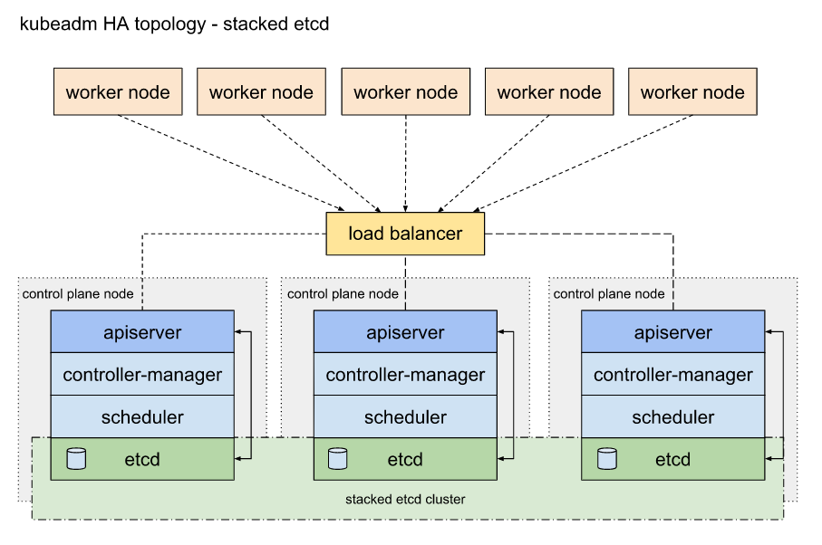
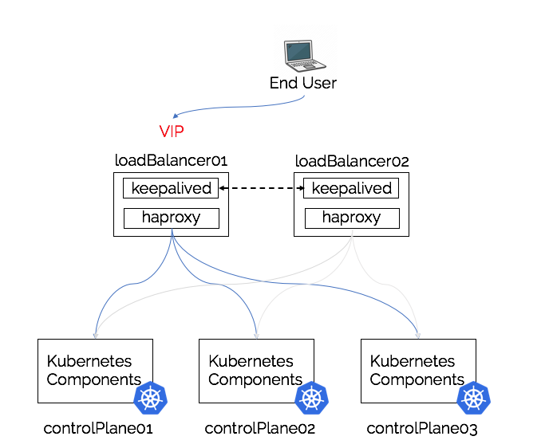
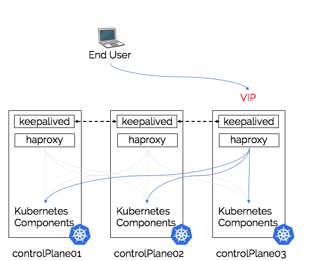
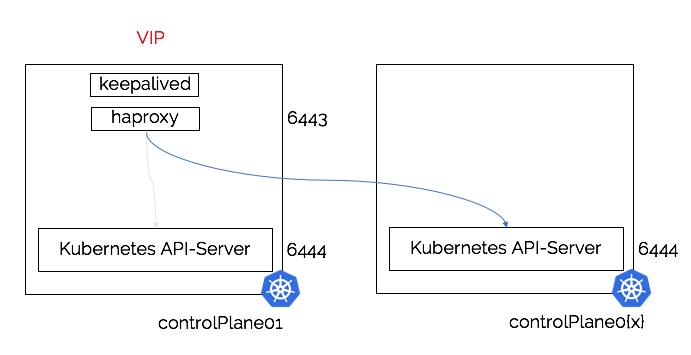

# Setup Kubernetes Highly Available Clusters

## 1. Overview

We can setup kubernetes clusters with stacked control plane nodes. This approach requires less infrastructure. The etcd members and control plane nodes are co-located.

The following diagram shows the architecture of a Kubernetes cluster with stacked control plane nodes.


## 2. Prerequisites

At least 3 nodes are required to setup a Kubernetes cluster with stacked control plane nodes. The following table shows the minimum requirements for each node.

- A compatible Linux host.
- 2 GB or more of RAM per machine (any less will leave little room for your apps).
- 2 CPUs or more.
- Full network connectivity between all machines in the cluster (public or private network is fine).
- Unique hostname, MAC address, and product_uuid for every node.
  ```bash
  # Get the MAC address of the network
  ip link or ifconfig -a
  ```
  ```bash
  # Check the product_uuid
  sudo cat /sys/class/dmi/id/product_uuid
  ```
- Certain ports are open on your machines.

  ```bash
  # The port 6443 is used for Kubernetes API server to communicate with the kubelet processes on each node.
  nc 127.0.0.1 6443
  ```

- Swap disabled. You MUST disable swap in order for the kubelet to work properly.

  ```bash
  #Turn off swap
  sudo cat /etc/fstab | grep -v swap > temp.fstab
  sudo cat temp.fstab > /etc/fstab
  rm temp.fstab
  sudo swapoff -a
  ```

## 3. Setup Kubernetes HA Cluster

### 3.1 Install Container Runtime

We can use containerd as the container runtime for Kubernetes. We can install containerd by following the steps in the [Install Containerd](install-containerd.md) document.

Also CRI-O can be used as an alternative. We can install CRI-O by following the steps in the [Install CRI-O](install-cri-o.md) document.

### 3.2 Install Kubernetes Components

- [Install kubeadm](https://kubernetes.io/docs/setup/production-environment/tools/kubeadm/install-kubeadm/)
- [Install kubelet](https://kubernetes.io/docs/tasks/tools/install-kubelet/)
- [Install kubectl](https://kubernetes.io/docs/tasks/tools/install-kubectl/)

### 3.3 Enable kubelet service

```bash
sudo systemctl enable --now kubelet
# For Alpine Linux use rc.update instead
rc-update add kubelet
```

## 4. LoadBalancing via keepalived & haproxy

### 4.1 Overview of LoadBalancing

You can eighter install LoadBalancing Components externalized or stacked as well. See below for architecture diagrams.

#### 4.1.1 External LoadBalancer



> Pros

- Load-Balancer is physically separate from Kubernetes Control pane nodes
- Only requires two instances/deployments of the required components
- Easy to scale as not tightly coupled to the control plane nodes
- Opportunity for Kubernetes services running in the cluster or other hosts to be load-balanced by the same external load-balancer

> Cons

- Requires it’s own hardware (or virtual hardware)
- Additional management and operational overhead

#### 4.1.2 Stacked LoadBalancer



> Pros

- Simplifies deployment, control plane nodes are always deployed with all of the required components
- Scaling becomes simplified, going from 3 -> 5 control plane nodes involves the deployments of 2 more control plane nodes and adding into load balancer/VIP configuration
- Reduces the infrastructure requirement as load-balancing shares the same infrastructure as the control plane components
- Possibility of one-day having kubeadm manage the load-balancing lifecycle in the same way that it now manages etcd

> Cons

- Tight coupling, can result in hard to debug networking, performance or configuration issues.
- An issue with either of the load-balancing components could have a knock-on effect to the control pane nodes without proper precautions in place.

<a id="stackPortConflict">Stack Port Conflict</a>

As we cannot bind the same port twice, there would be a port conflict if we do not choose another port for api server.

Thus you will need to run kubeadm init with --control-plane-endpoint dnsname:6444 command like this [kubeadm init --control-plane-endpoint](#kubeadmInitControlPlaneEndpoint)



### 4.2 Prepare LoadBalancer Configuration

#### 4.2.1 KeepAlived

KeepAlived configuration consists of keepalived.conf & check_apiserver.sh.

> keepalived.conf

```bash
! /etc/keepalived/keepalived.conf
! Configuration File for keepalived
global_defs {
    router_id LVS_DEVEL
}
vrrp_script check_apiserver {
  script "/etc/keepalived/check_apiserver.sh"
  interval 3
  weight -2
  fall 10
  rise 2
}

vrrp_instance VI_1 {
    state ${STATE}
    interface ${INTERFACE}
    virtual_router_id ${ROUTER_ID}
    priority ${PRIORITY}
    authentication {
        auth_type PASS
        auth_pass ${AUTH_PASS}
    }
    virtual_ipaddress {
        ${APISERVER_VIP}
    }
    track_script {
        check_apiserver
    }
}
```

- ${STATE} is MASTER for one and BACKUP for all other hosts, hence the virtual IP will initially be assigned to the MASTER.
- ${INTERFACE} is the network interface taking part in the negotiation of the virtual IP, e.g. eth0.
- ${ROUTER_ID} should be the same for all keepalived cluster hosts while unique amongst all clusters in the same subnet. Many distros pre-configure its value to 51.
- ${PRIORITY} should be higher on the control plane node than on the backups. Hence 101 and 100 respectively will suffice.
- ${AUTH_PASS} should be the same for all keepalived cluster hosts, e.g. 42
- ${APISERVER_VIP} is the virtual IP address negotiated between the keepalived cluster hosts.

> check_apiserver.sh

```bash
#!/bin/sh

errorExit() {
    echo "*** $*" 1>&2
    exit 1
}

curl --silent --max-time 2 --insecure https://localhost:${APISERVER_DEST_PORT}/ -o /dev/null || errorExit "Error GET https://localhost:${APISERVER_DEST_PORT}/"
if ip addr | grep -q ${APISERVER_VIP}; then
    curl --silent --max-time 2 --insecure https://${APISERVER_VIP}:${APISERVER_DEST_PORT}/ -o /dev/null || errorExit "Error GET https://${APISERVER_VIP}:${APISERVER_DEST_PORT}/"
fi
```

#### 4.2.2 HAProxy

HAProxy configuration consists of haproxy.cfg

```bash
# /etc/haproxy/haproxy.cfg
#---------------------------------------------------------------------
# Global settings
#---------------------------------------------------------------------
global
    log /dev/log local0
    log /dev/log local1 notice
    daemon

#---------------------------------------------------------------------
# common defaults that all the 'listen' and 'backend' sections will
# use if not designated in their block
#---------------------------------------------------------------------
defaults
    mode                    http
    log                     global
    option                  httplog
    option                  dontlognull
    option http-server-close
    option forwardfor       except 127.0.0.0/8
    option                  redispatch
    retries                 1
    timeout http-request    10s
    timeout queue           20s
    timeout connect         5s
    timeout client          20s
    timeout server          20s
    timeout http-keep-alive 10s
    timeout check           10s

#---------------------------------------------------------------------
# apiserver frontend which proxys to the control plane nodes
#---------------------------------------------------------------------
frontend apiserver
    bind *:${APISERVER_DEST_PORT}
    mode tcp
    option tcplog
    default_backend apiserver

#---------------------------------------------------------------------
# round robin balancing for apiserver
#---------------------------------------------------------------------
backend apiserver
    option httpchk GET /healthz
    http-check expect status 200
    mode tcp
    option ssl-hello-chk
    balance     roundrobin
        server ${HOST1_ID} ${HOST1_ADDRESS}:${APISERVER_SRC_PORT} check
        # [...]
```

- ${APISERVER_DEST_PORT} the port through which Kubernetes will talk to the API Server.
- ${APISERVER_SRC_PORT} the port used by the API Server instances
- ${HOST1_ID} a symbolic name for the first load-balanced API Server host
- ${HOST1_ADDRESS} a resolvable address (DNS name, IP address) for the first load-balanced API Server host
  additional server lines, one for each load-balanced API Server host

### 4.3 Install LoadBalancer Components

#### 4.3.1 LoadBalancer via package manager

This approach make sense if we are using externalized topology.

```bash
systemctl enable haproxy --now
systemctl enable keepalived --now
```

#### 4.3.2 LoadBalancer via static pods in kubernetes cluster

If keepalived and haproxy will be running on the control plane nodes they can be configured to run as static pods.

For this setup, two manifest files need to be created in /etc/kubernetes/manifests (create the directory first).

> keepalived.yaml

Create a yaml file with below contents and copy to /etc/kubernetes/manifests/keepalived.yaml:

```yaml
apiVersion: v1
kind: Pod
metadata:
  creationTimestamp: null
  name: keepalived
  namespace: kube-system
spec:
  containers:
    - image: osixia/keepalived:2.0.17
      name: keepalived
      resources: {}
      securityContext:
        capabilities:
          add:
            - NET_ADMIN
            - NET_BROADCAST
            - NET_RAW
      volumeMounts:
        - mountPath: /usr/local/etc/keepalived/keepalived.conf
          name: config
        - mountPath: /etc/keepalived/check_apiserver.sh
          name: check
  hostNetwork: true
  volumes:
    - hostPath:
        path: /etc/keepalived/keepalived.conf
      name: config
    - hostPath:
        path: /etc/keepalived/check_apiserver.sh
      name: check
status: {}
```

> haproxy.yaml

> Note that you need to replace ${APISERVER_DEST_PORT} with the actual value, which is the same as configured in haproxy.cfg.

Create a yaml file with below contents and copy to /etc/kubernetes/manifests/haproxy.yaml:

```yaml
apiVersion: v1
kind: Pod
metadata:
  name: haproxy
  namespace: kube-system
spec:
  containers:
    - image: haproxy:2.1.4
      name: haproxy
      livenessProbe:
        failureThreshold: 8
        httpGet:
          host: localhost
          path: /healthz
          port: ${APISERVER_DEST_PORT}
          scheme: HTTPS
      volumeMounts:
        - mountPath: /usr/local/etc/haproxy/haproxy.cfg
          name: haproxyconf
          readOnly: true
  hostNetwork: true
  volumes:
    - hostPath:
        path: /etc/haproxy/haproxy.cfg
        type: FileOrCreate
      name: haproxyconf
status: {}
```

## 5. Configure Kubernetes

### 5.1 Init Kubernetes Cluster

> create a file named kubeadm-config.yaml on master1 with below content:

```yaml
# kubeadm-config.yaml
kind: InitConfiguration
apiVersion: kubeadm.k8s.io/v1beta3
localAPIEndpoint:
  advertiseAddress: "192.168.74.133"
  bindPort: 6444
nodeRegistration:
  criSocket: "unix:///var/run/crio/crio.sock"
---
kind: ClusterConfiguration
apiVersion: kubeadm.k8s.io/v1beta3
kubernetesVersion: v1.24.3
networking:
  serviceSubnet: "10.96.0.0/16"
  podSubnet: "10.244.0.0/24"
controlPlaneEndpoint: "192.168.74.100:6443"
---
kind: KubeletConfiguration
apiVersion: kubelet.config.k8s.io/v1beta1
cgroupDriver: systemd
```

> create a file named kubeadm-config.yaml on master2, master3 with below content:

```yaml
kind: JoinConfiguration
apiVersion: kubeadm.k8s.io/v1beta3
localAPIEndpoint:
  bindPort: 6444
```

> Execute below command on master1:

Note that the port 6444 is different from the default 6443, cuz we need to deploy a load balancer which make use of this port.
See [Stack Port Conflict](#stackPortConflict) for more information

<a id="kubeadmInitControlPlaneEndpoint">kubeadm init command</a>

```bash
# Ensure that the container runtime is running before executing kubeadm init
sudo kubeadm init --control-plane-endpoint dnsname:6444
# Or configure controlPlaneEndpoint inside kubeadm-config.yaml and bootstrap with
sudo kubeadm init --config kubeadm-config.yaml
```

### 5.2 Configure kubectl

> Execute below command on master1:

```bash
mkdir -p $HOME/.kube
sudo cp -i /etc/kubernetes/admin.conf $HOME/.kube/config
sudo chown $(id -u):$(id -g) $HOME/.kube/config
```

```bash
# Verify the cluster status by kubectl
kubectl get nodes
```

### 5.3 Install pod network

```bash
# Install Calico
kubectl apply -f https://raw.githubusercontent.com/projectcalico/calico/master/manifests/calico.yaml
```

### 5.4 Use crictl to check container runtime

```bash
# Use crictl to check container runtime
sudo crictl ps
```

## 6. Troubleshooting

### 6.1 Use journalctl to check kubelet logs

```bash
sudo journalctl -u kubelet -fex
```

### 6.2 Swap is enabled

If you got error like below, you can try to disable swap and try again.

```bash
[init] Using Kubernetes version: v1.24.3
[preflight] Running pre-flight checks
        [WARNING Swap]: running with swap on is not supported. Please disable swap
[preflight] Some fatal errors occurred:
        [ERROR Swap]: running with swap on is not supported. Please disable swap
```

### 6.3 IP_Forward is not enabled

- If you got error like below, you can try step Forwarding IPv4 and letting iptables see bridged traffic above.

```bash
[init] Using Kubernetes version: v1.24.3
[preflight] Running pre-flight checks
	[WARNING Firewalld]: firewalld is active, please ensure ports [6443 10250] are open or your cluster may not function correctly
	[WARNING SystemVerification]: missing optional cgroups: blkio
	[WARNING Service-Kubelet]: kubelet service is not enabled, please run 'systemctl enable kubelet.service'
error execution phase preflight: [preflight] Some fatal errors occurred:
	[ERROR FileContent--proc-sys-net-bridge-bridge-nf-call-iptables]: /proc/sys/net/bridge/bridge-nf-call-iptables does not exist
	[ERROR FileContent--proc-sys-net-ipv4-ip_forward]: /proc/sys/net/ipv4/ip_forward contents are not set to 1
```

### 6.4 Coredns is stuck in pending state

```bash
kubectl get pods -n kube-system
NAME                              READY   STATUS    RESTARTS   AGE
coredns-7cb95cd867-9gjrw          0/1     Pending   0          13m
coredns-7cb95cd867-g999p          0/1     Pending   0          13m
etcd-master1                      1/1     Running   0          13m
kube-apiserver-master1            1/1     Running   0          13m
kube-controller-manager-master1   1/1     Running   0          13m
kube-proxy-jrwwn                  1/1     Running   0          13m
kube-scheduler-master1            1/1     Running   0          13m
```

```bash
# Use describe command to check the reason:
kubectl describe -n kube-system pod coredns-7cb95cd867-9gjrw
```

```bash
# Use journalctl to check the log:
sudo journalctl -u kubelet -f
```

```bash
# Message like below will be shown:
Nov 15 11:09:17 master1 kubelet[16432]: E1115 11:09:17.084187   16432 kubelet.go:2349] "Container runtime network not ready" networkReady="NetworkReady=false reason:NetworkPluginNotReady message:Network plugin returns error: No CNI configuration file in /etc/cni/net.d/. Has your network provider started?"
```

As the error message said, we need to install a CNI plugin, such as calico, flannel, etc.

We also checked the official document, which stated that the CNI plugin is not installed by default.

> This is expected and part of the design. kubeadm is network provider-agnostic, so the admin should [install the pod network add-on](https://kubernetes.io/docs/setup/production-environment/tools/kubeadm/create-cluster-kubeadm/#pod-network) of choice. You have to install a Pod Network before CoreDNS may be deployed fully. Hence the Pending state before the network is set up.

So we need to install a CNI plugin, such as calico, flannel, etc.

```bash
# Install calico via manifest hosted on https://github.com/projectcalico/calico
kubectl apply -f https://raw.githubusercontent.com/projectcalico/calico/master/manifests/calico.yaml
```

```bash
# Check the status of coredns, it should be running now.
kubectl get pods -n kube-system
```

### 6.5 Container runtime is not running

When you execute kubeadm init on ubuntu server, you may get error like below, you can remove /etc/containerd/config.toml and restart containerd service.

```bash
[init] Using Kubernetes version: v1.25.3
[preflight] Running pre-flight checks
	[WARNING SystemVerification]: missing optional cgroups: blkio
error execution phase preflight: [preflight] Some fatal errors occurred:
	[ERROR CRI]: container runtime is not running: output: E1115 08:18:34.498184   36071 remote_runtime.go:948] "Status from runtime service failed" err="rpc error: code = Unimplemented desc = unknown service runtime.v1alpha2.RuntimeService"
time="2022-11-15T08:18:34Z" level=fatal msg="getting status of runtime: rpc error: code = Unimplemented desc = unknown service runtime.v1alpha2.RuntimeService"
```

### 6.6 Cannot resolve dns after cluster created

When use kubectl apply to run application on cluster, an error occurred like below:

```bash
wujuntao@master1:~/kubernetes> kubectl apply -f https://raw.githubusercontent.com/kubernetes/dashboard/v2.6.1/aio/deploy/recommended.yaml
"The connection to the server raw.githubusercontent.com was refused - did you specify the right host or port?"
```

> We can check and ensure the dns works with below commands:

```bash
# Use nslookup to check if domain could be resolved
nslookup raw.githubusercontent.com
# Edit network config
sudo vim /etc/sysconfig/network/config
# Set dns servers
NETCONFIG_DNS_STATIC_SERVERS="4.2.2.4"
# Update network config
sudo netconfig update -f
```

### 6.7 Pods stuck in Pending status

When we run kubernetes-dashboard via below command:

```bash
# Run kubernetes dashboard
kubectl apply -f https://raw.githubusercontent.com/kubernetes/dashboard/v2.6.1/aio/deploy/recommended.yaml
# Check pod status
kubectl get all --all-namespaces
wujuntao@master1:~/kubernetes> kubectl get all --all-namespaces
# the status is stuck in pending
NAMESPACE              NAME                                            READY   STATUS    RESTARTS       AGE
kubernetes-dashboard   pod/dashboard-metrics-scraper-8c47d4b5d-qxh69   0/1     Pending   0              21m
kubernetes-dashboard   pod/kubernetes-dashboard-6c75475678-cc49l       0/1     Pending   0              21m
```

> Use describe pod command to check reason

```bash
kubectl describe -n kubernetes-dashboard pod/dashboard-metrics-scraper-8c47d4b5d-qxh69
Events:
  Type     Reason            Age                From               Message
  ----     ------            ----               ----               -------
  Warning  FailedScheduling  15s (x6 over 25m)  default-scheduler  0/3 nodes are available: 3 node(s) had untolerated taint {node-role.kubernetes.io/control-plane: }. preemption: 0/3 nodes are available: 3 Preemption is not helpful for scheduling.
```

- untolerated taint { node-role.kubernetes.io/control-plane: }
  That is all of our nodes in cluster is control-plane, kubernetes-dashboard set below condition for toleration:
  tolerations:
  - key: node-role.kubernetes.io/master
    effect: NoSchedule

You can override tolerations or run some worker nodes to avoid this problem.

### 6.8 Calico not running

```bash
Warning  Unhealthy     3m26s (x2 over 3m26s)  kubelet            Readiness probe failed: calico/node is not ready: BIRD is not ready: Error querying BIRD: unable to connect to BIRDv4 socket: dial unix /var/run/calico/bird.ctl: connect: connection refused
```

Calico needs auto detection for multiple ip address interface. Calico will detect the first available interface as the interface. So we need to configure a Virtual IP lower than the Real IP for ordering issue.

### 6.8 Calico BIRD not ready

> Senario:

The service cannot be accessed via nodePort, but the related pods were running correctly.

```bash
  Warning  Unhealthy  13m (x2 over 13m)  kubelet            Readiness probe failed: calico/node is not ready: BIRD is not ready: Error querying BIRD: unable to connect to BIRDv4 socket: dial unix /var/run/calico/bird.ctl: connect: connection refused
  Warning  Unhealthy  13m                kubelet            Readiness probe failed: 2023-02-22 01:33:46.419 [INFO][224] confd/health.go 180: Number of node(s) with BGP peering established = 3
calico/node is not ready: BIRD is not ready: BGP not established with 172.22.0.1
  Warning  Unhealthy  13m  kubelet  Readiness probe failed: 2023-02-22 01:33:56.462 [INFO][258] confd/health.go 180: Number of node(s) with BGP peering established = 3
calico/node is not ready: BIRD is not ready: BGP not established with 172.22.0.1
  Warning  Unhealthy  12m  kubelet  Readiness probe failed: 2023-02-22 01:34:06.416 [INFO][285] confd/health.go 180: Number of node(s) with BGP peering established = 3
calico/node is not ready: BIRD is not ready: BGP not established with 172.22.0.1
```

This is because sometimes calico autodetect the wrong interface. So we need to modify the calico.yaml and add an IP_AUTODETECTION_METHOD with a regexp value, e.g. "interface=eth\*".

1. Download the original calico.yaml from [https://raw.githubusercontent.com/projectcalico/calico/master/manifests/calico.yaml](https://raw.githubusercontent.com/projectcalico/calico/master/manifests/calico.yaml).

The original config part is as below:

```yaml
# Auto-detect the BGP IP address.
- name: IP
  value: "autodetect"
```

2. Add IP_AUTODETECTION_METHOD with a proper value

```yaml
# Auto-detect the BGP IP address.
- name: IP
  value: "autodetect"
- name: IP_AUTODETECTION_METHOD
  value: "interface=eth*"
```

> Note: you should use ip address to confirm which interface name should be used (might be 'eth', 'ens', etc.).

3. Use kubectl apply to use the new config

```bash
kubectl apply -f calico.yaml
```

### 6.9 Calico tolerations

```bash
Tolerations:                 CriticalAddonsOnly op=Exists
                             node-role.kubernetes.io/control-plane:NoSchedule
                             node-role.kubernetes.io/master:NoSchedule
                             node.kubernetes.io/not-ready:NoExecute op=Exists for 300s
                             node.kubernetes.io/unreachable:NoExecute op=Exists for 300s
```

As calico tolerations above, we can untaint the node using below commands:

```bash
# untaint control-plane & master
kubectl taint nodes --all node-role.kubernetes.io/control-plane-
kubectl taint nodes --all node-role.kubernetes.io/master-
# taint not-ready:NoExecute
# kubectl taint nodes --all node.kubernetes.io/not-ready:NoExecute
```

### 6.10 Container runtime network not ready

```bash
KubeletNotReady              container runtime network not ready: NetworkReady=false reason:NetworkPluginNotReady message:Network plugin returns error: No CNI configuration file in /etc/cni/net.d/. Has your network provider started?
```

Please check /etc/crio/crio.conf or /etc/crio/crio.conf.d/ for [crio.network] configuration.

```toml
# The crio.network table containers settings pertaining to the management of
# CNI plugins.
[crio.network]

# The default CNI network name to be selected. If not set or "", then
# CRI-O will pick-up the first one found in network_dir.
# cni_default_network = ""

# Path to the directory where CNI configuration files are located.
network_dir = "/etc/cni/net.d/"

# Paths to directories where CNI plugin binaries are located.
plugin_dirs = [
	"/opt/cni/bin/",
	"/usr/libexec/cni/",
]
```

### 6.11 path "/sys" is not a shared mount point

When applying calico.yaml, such error as below occurred like: Error: path "/sys/fs" is mounted on "/sys" but it is not a shared mount

```bash
Events:
  Type     Reason     Age                From               Message
  ----     ------     ----               ----               -------
  Normal   Scheduled  29s                default-scheduler  Successfully assigned kube-system/calico-node-2mrlq to node206
  Normal   Pulled     29s                kubelet            Container image "docker.io/calico/cni:master" already present on machine
  Normal   Created    28s                kubelet            Created container upgrade-ipam
  Normal   Started    28s                kubelet            Started container upgrade-ipam
  Normal   Pulled     28s                kubelet            Container image "docker.io/calico/cni:master" already present on machine
  Normal   Created    27s                kubelet            Created container install-cni
  Normal   Started    27s                kubelet            Started container install-cni
  Normal   Pulled     12s (x3 over 27s)  kubelet            Container image "docker.io/calico/node:master" already present on machine
  Warning  Failed     12s (x3 over 27s)  kubelet            Error: path "/var/run/calico" is mounted on "/" but it is not a shared mount
```

Or maybe you can find such mount error above in /var/log/kubelet/kubelet.log, it depends.

To fix this, use below commands to make shared mount.

```bash
mount --make-shared /sys
mount --make-shared /
# after that, restart crio service to apply changes.
rc-service crio restart
```
