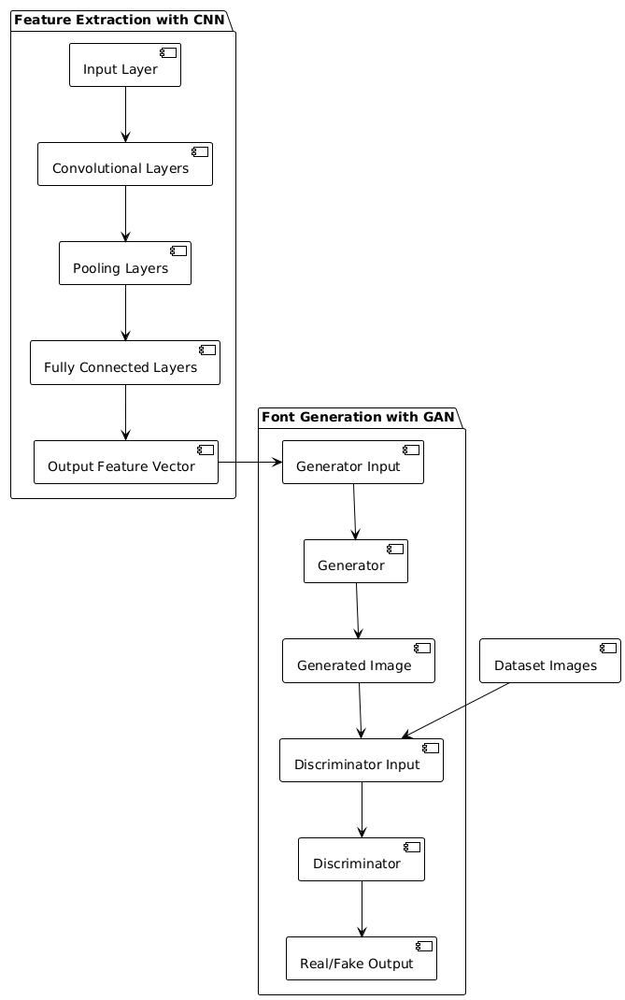
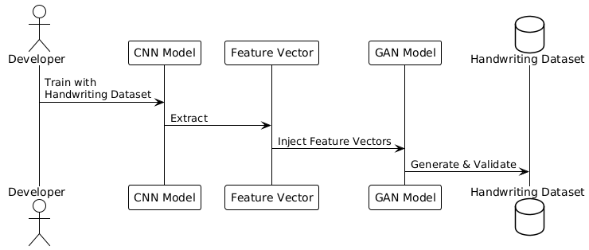

# Design Document for Feature Extraction and Font Generation Using CNN and GAN

## Overview

This document outlines the design and architecture of a system for generating custom fonts, specifically focusing on Chinese characters, by integrating Convolutional Neural Networks (CNN) for feature extraction and Generative Adversarial Networks (GAN) for font generation. The goal is to create a model that can learn from a dataset of handwriting samples and generate new, realistic, and diverse handwriting styles.

## System Architecture

### Feature Extraction with CNN

#### Objective
Extract meaningful feature vectors from handwriting samples that capture the unique styles and intricacies of Chinese characters.

#### Model Architecture
- **Input Layer**: Accepts grayscale images of Chinese characters, normalized to a size of 128x128 pixels.
- **Convolutional Layers**: Multiple convolutional layers with increasing filter sizes and ReLU activation to extract hierarchical features.
- **Pooling Layers**: Applied after convolutional layers to reduce dimensionality and retain essential features.
- **Fully Connected Layers**: Dense layers towards the end to generate a compact feature vector representing each handwriting style.
- **Output**: A feature vector of fixed size (e.g., 256 dimensions) that encodes the handwriting style.

#### Training
- **Dataset**: A curated collection of Chinese handwriting samples, labeled with styles or authors.
- **Loss Function**: Cross-entropy loss for style classification.
- **Optimizer**: Adam optimizer with learning rate adjustments based on validation loss.

### Font Generation with GAN

#### Objective
Generate new handwriting styles based on the feature vectors extracted by the CNN.

#### Model Architecture

##### Generator
- **Input**: Concatenation of a random noise vector and a feature vector from the CNN.
- **Architecture**: A series of transposed convolutional layers that gradually upscale the input to the size of a handwriting sample (128x128 pixels). Each layer includes batch normalization and ReLU activation.
- **Output**: A generated image of a Chinese character in a new handwriting style.

##### Discriminator
- **Input**: Real images from the dataset or generated images from the Generator.
- **Architecture**: A series of convolutional layers that gradually downscale the input, with LeakyReLU activation and dropout to prevent overfitting.
- **Output**: A single scalar representing the probability that the input image is real.

#### Training
- **Adversarial Training**: The Generator and Discriminator are trained simultaneously in a min-max game, where the Generator aims to fool the Discriminator, and the Discriminator aims to correctly classify real and generated images.
- **Loss Functions**: Binary cross-entropy loss for both Generator and Discriminator.
- **Optimizer**: Separate Adam optimizers for both Generator and Discriminator.

## Integration Strategy

- **Feature Vector Injection**: The feature vectors extracted by the CNN are directly fed into the Generator as part of its input, guiding the generation process with learned styles.
- **Sequential Training**: The CNN is trained first to ensure high-quality feature extraction. The GAN is trained afterward, utilizing the pre-trained CNN's feature vectors.
- **Feedback Loop**: The quality of generated fonts is periodically evaluated, and insights are used to fine-tune both the CNN and GAN models.

## Evaluation Metrics

- **For CNN**: Accuracy of style classification on a validation set.
- **For GAN**: Fréchet Inception Distance (FID) to measure the quality and diversity of generated images compared to real images.

## Conclusion

This design document presents a comprehensive approach to generating custom fonts for Chinese characters by leveraging the strengths of CNNs for feature extraction and GANs for font generation. By carefully designing and integrating these models, we aim to create a system capable of producing high-quality, diverse handwriting styles that can be used for various applications in typography and digital art.