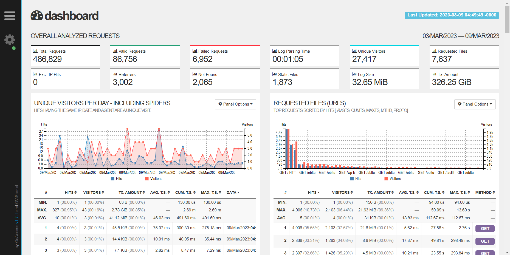

# Use GoAccess to analyze nginx access log

## Introduction

[GoAccess](https://goaccess.io/) is a real-time web log analyzer and interactive viewer that runs in a terminal in \*nix systems or through your browser. It provides fast and valuable HTTP statistics for system administrators that require a visual server report on the fly.

## Enable nginx response time

```bash
# Add the following line to your nginx.conf
log_format  main  '$remote_addr - $remote_user [$time_local] "$request" '
                  '$status $body_bytes_sent "$http_referer" '
                  '"$http_user_agent" "$http_x_forwarded_for" '
                  '$request_time $upstream_response_time $pipe';
# Use below line to enable main log format, otherwise, the combined log format will be used
access_log  /var/log/nginx/access.log  main;
```

## Use GoAccess via Docker/Podman

### GoAccess LOG_FORMAT

```bash
# use below log_format to parse nginx access log with response time
%h %^[%d:%t %^] "%r" %s %b "%R" "%u" "%^" %T %^ %^
```

### Execute GoAccess

```bash
docker run --rm -it -v /var/log/nginx:/var/log/nginx allinurl/goaccess:latest -f /var/log/nginx/access.log -o /var/log/nginx/report.html --log-format=COMBINED --real-time-html
```

### only get the report

```bash
# Use docker
cat access.log | docker run --rm -i -e LANG=$LANG allinurl/goaccess -a -o html --log-format COMBINED - > report.html
# Use podman
cat access.log | podman run --rm -i -e LANG=$LANG allinurl/goaccess -a -o html --log-format COMBINED - > report.html
```

### Get realtime report

```bash
# Use docker
tail -F access.log | docker run -p 7890:7890 --rm -i -e LANG=$LANG allinurl/goaccess -a -o html --log-format COMBINED --real-time-html - > report.html
# Use Podman
tail -F access.log | podman run -p 7890:7890 --rm -i -e LANG=$LANG allinurl/goaccess -a -o html --log-format COMBINED --real-time-html - > report.html
```

## Use GoAccess via docker-compose / podman-compose

### Docker-Compose file

Refer to [docker-compose.goaccess.yml](./templates/docker-compose.goaccess.yml) for more information

You can change --log-format to your own log format as stated in [GoAccess LOG_FORMAT](#goaccess-log_format)

```yml
version: "3.7"
services:
  goaccess:
    image: allinurl/goaccess
    container_name: goaccess
    restart: always
    ports:
      - 7890:7890
    volumes:
      # Note the access.log host path, you should change it to your own path
      - /var/log/nginx/access.log:/goaccess/log/nginx/access.log:ro
      - public_html:/goaccess/www/html:rw
    command: -f /goaccess/log/nginx/access.log -o /goaccess/www/html/index.html --log-format=COMBINED --real-time-html --ws-url=ws://localhost:7890
  nginx:
    image: nginx:alpine
    container_name: nginx
    restart: always
    ports:
      - 17080:80
    volumes:
      - public_html:/usr/share/nginx/html:ro
volume:
  public_html:
```

## Access GoAccess UI

You can access the GoAccess UI via http://localhost:17080 now. And it's convenient to use a nginx server to proxy_pass the GoAccess UI.


