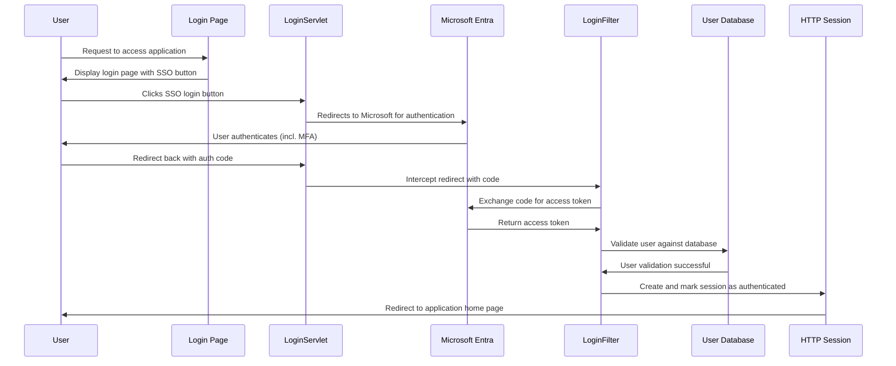

# Solution Design Document: SSO Integration with Microsoft Entra

## Introduction

This document outlines the solution design for integrating Single Sign-On (SSO) functionality into a web application using Microsoft Entra for authentication. The integration enables users to authenticate using their Microsoft Enterprise accounts, leveraging Azure Active Directory (AAD) for a secure and streamlined login process.

## Solution Overview

The SSO integration process involves several key components of the web application working together to authenticate a user through Microsoft Entra. The process starts when a user attempts to access a protected resource and is redirected to log in, and it concludes when the user is authenticated and granted access.

## Sequence Diagram

The sequence diagram below illustrates the flow of operations for the SSO process:

## Process Description

1. **User Request**: The user attempts to access the application and is redirected to the login page.
2. **Display Login Page**: The login page is displayed to the user, including an SSO login button.
3. **SSO Login**: The user clicks the SSO login button, triggering a request to `LoginServlet`.
4. **Redirect to Microsoft Entra**: `LoginServlet` redirects the user to Microsoft Entra for authentication.
5. **User Authentication**: The user authenticates with Microsoft Entra, including any required Multi-Factor Authentication (MFA).
6. **Redirect Back with Authorization Code**: After successful authentication, Microsoft Entra redirects the user back to the application, providing an authorization code.
7. **Code Exchange**: `LoginFilter` intercepts the redirect and exchanges the authorization code for an access token with Microsoft Entra.
8. **User Validation**: The access token is used to validate the user against the application's user database.
9. **Session Creation**: Upon successful validation, a session is created and marked as authenticated.
10. **Access Granted**: The user is redirected to the application's home page, now with access to protected resources.

## Conclusion

This solution design document provides an overview of integrating SSO using Microsoft Entra into a web application. By following the outlined process, the application can securely authenticate users with their Microsoft Enterprise accounts, enhancing the user experience and security posture.