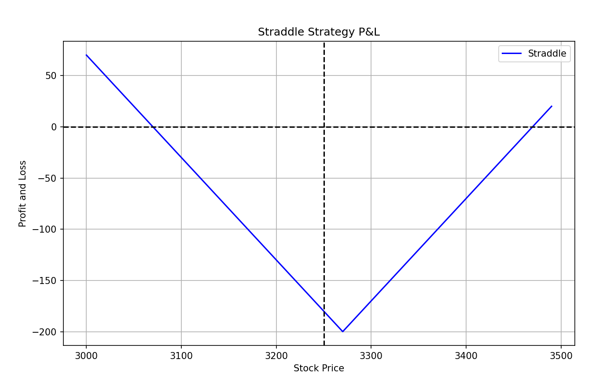
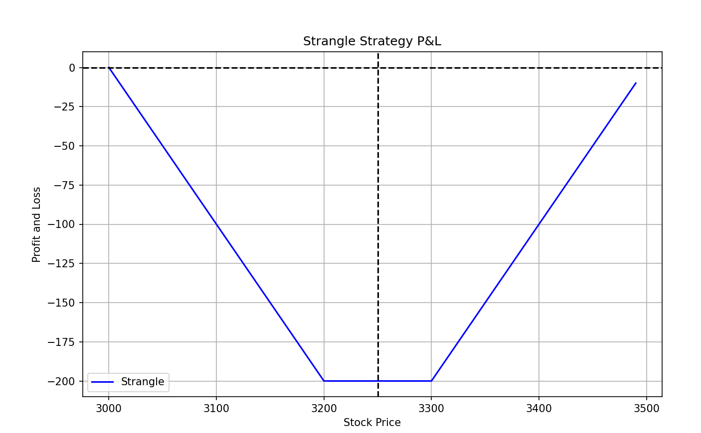

# Options Trading Analysis Report

## Table of Contents
- [Options Trading Analysis Report](#options-trading-analysis-report)
  - [Table of Contents](#table-of-contents)
  - [Introduction to Options Trading](#introduction-to-options-trading)
  - [Market Analysis Example](#market-analysis-example)
    - [Recent Market Activity](#recent-market-activity)
  - [Multi-Leg Strategies](#multi-leg-strategies)
    - [Straddle](#straddle)
    - [Strangle](#strangle)
    - [Vertical Spread](#vertical-spread)
      - [Bull Call Spread](#bull-call-spread)
      - [Bear Call Spread](#bear-call-spread)
      - [Bull Put Spread](#bull-put-spread)
      - [Bear Put Spread](#bear-put-spread)
    - [Calendar Spread](#calendar-spread)
    - [Butterfly Spread](#butterfly-spread)
    - [Condor](#condor)
    - [Iron Condor](#iron-condor)
    - [Iron Butterfly](#iron-butterfly)
  - [Recommended Strategies](#recommended-strategies)
    - [Straddle](#straddle-1)
    - [Strangle](#strangle-1)
  - [Conclusion](#conclusion)

## Introduction to Options Trading

Options are a type of derivative security that give the holder the right to buy or sell an asset at a predetermined price before a specific date. There are two types of options:
- **Calls**: Give the holder the right to buy an asset at a predetermined price.
- **Puts**: Give the holder the right to sell an asset at a predetermined price.

Options are versatile financial instruments used for:
- Speculation
- Hedging
- Income generation

While options trading can be risky, proper risk management and strategy can make it a profitable endeavor.

## Market Analysis Example

### Recent Market Activity

Recently, China has been investing heavily in its stock market, leading to a significant rise in Chinese stocks and increased market volatility. For instance:
- The Shanghai Composite Index rose from 2,680 on September 25, 2024, to 3,270 on September 30, 2024.
- The index has shown substantial daily movements, indicating high volatility.
- The international market is also bullish on Chinese concepts, including Hong Kong and US Chinese stocks.

## Multi-Leg Strategies

### Straddle
- **Description**: A straddle involves buying both a call and a put option at the same strike price and expiration date.
- **Example**: Buy a call and a put option at the strike price of 3,270.
- **Benefit**: Profits from large price movements in either direction.
- **Command**:
  ```sh
  python straddle_pnl.py straddle --strike_price 3270 --premium_call 100 --premium_put 100
  ```

    

### Strangle
- **Description**: A strangle involves buying a call option at a higher strike price and a put option at a lower strike price, typically out-of-the-money.
- **Example**: Buy a call option at 3,300 and a put option at 3,200.
- **Benefit**: Typically cheaper than a straddle but requires a larger price movement to be profitable.
- **Command**:
  ```sh
  python straddle_pnl.py strangle --strike_price_call 3300 --strike_price_put 3200 --premium_call 100 --premium_put 100
  ```
  

### Vertical Spread

#### Bull Call Spread
- **Description**: Buying a call option at a lower strike price and selling a call option at a higher strike price.
- **Example**: 
  - Buy a call option at 3,270 for a premium of $50.
  - Sell a call option at 3,300 for a premium of $30.
- **Benefit**: Profits from moderate upward price movements.
- **Command**:
  ```sh
  python straddle_pnl.py vertical_spread --strike_price_long 3270 --strike_price_short 3300 --premium_long 100 --premium_short 50
  ```

#### Bear Call Spread
- **Description**: Selling a call option at a lower strike price and buying a call option at a higher strike price.
- **Example**: 
  - Sell a call option at 3,270.
  - Buy a call option at 3,300.
- **Benefit**: Profits from moderate downward price movements.
- **Command**:
  ```sh
  python straddle_pnl.py vertical_spread --strike_price_long 3300 --strike_price_short 3270 --premium_long 50 --premium_short 100
  ```

#### Bull Put Spread
- **Description**: Selling a put option at a higher strike price and buying a put option at a lower strike price.
- **Example**: 
  - Sell a put option at 3,300.
  - Buy a put option at 3,270.
- **Benefit**: Profits from moderate upward price movements.
- **Command**:
  ```sh
  python straddle_pnl.py vertical_spread --strike_price_long 3270 --strike_price_short 3300 --premium_long 50 --premium_short 100
  ```

#### Bear Put Spread
- **Description**: Buying a put option at a higher strike price and selling a put option at a lower strike price.
- **Example**: 
  - Buy a put option at 3,300.
  - Sell a put option at 3,270.
- **Benefit**: Profits from moderate downward price movements.
- **Command**:
  ```sh
  python straddle_pnl.py vertical_spread --strike_price_long 3300 --strike_price_short 3270 --premium_long 100 --premium_short 50
  ```

### Calendar Spread
- **Description**: A calendar spread involves buying and selling two options of the same type and strike price but with different expiration dates.
- **Example**: 
  - Buy a call option expiring in December.
  - Sell a call option expiring in November.
- **Benefit**: Profits from changes in volatility and time decay.
- **Command**: 
  ```sh
  python straddle_pnl.py calendar_spread --strike_price 3270 --premium_near 50 --premium_far 100
  ```

### Butterfly Spread
- **Description**: A butterfly spread involves buying and selling multiple options to create a position that profits from low volatility and a stable market.
- **Example**: 
  - Buy a call option at 3,250.
  - Sell two call options at 3,270.
  - Buy a call option at 3,290.
- **Benefit**: Limited risk and reward, suitable for low volatility markets.
- **Command**:
    ```sh
    python straddle_pnl.py butterfly_spread --strike_price_low 3250 --strike_price_mid 3270 --strike_price_high 3290 --premium_low 20 --premium_mid 50 --premium_high 20
    ```

### Condor
- **Description**: A condor involves buying and selling multiple options to create a position that profits from low volatility and a stable market, similar to an iron condor but with different strike prices.
- **Example**: 
  - Buy a call option at 3,250.
  - Sell a call option at 3,270.
  - Sell a call option at 3,290.
  - Buy a call option at 3,310.
- **Benefit**: Limited risk and reward, suitable for low volatility markets.
- **Command**:
    ```sh
    python straddle_pnl.py condor --strike_price_low 3250 --strike_price_mid_low 3270 --strike_price_mid_high 3290 --strike_price_high 3310 --premium_low 20 --premium_mid_low 50 --premium_mid_high 50 --premium_high 20
    ```

### Iron Condor
- **Description**: An iron condor involves selling a strangle and buying a strangle further out-of-the-money, creating a position that profits from low volatility and a stable market.
- **Example**: 
  - Sell a call option at 3,300 and a put option at 3,200.
  - Buy a call option at 3,350 and a put option at 3,150.
- **Benefit**: Profits from low volatility and a stable market, with limited risk and reward.
- **Command**:
    ```sh
    python straddle_pnl.py iron_condor --strike_price_call_short 3300 --strike_price_call_long 3350 --strike_price_put_short 3200 --strike_price_put_long 3150 --premium_call_short 50 --premium_call_long 20 --premium_put_short 50 --premium_put_long 20
    ```

### Iron Butterfly
- **Description**: An iron butterfly involves selling a straddle and buying a strangle further out-of-the-money, creating a position that profits from low volatility and a stable market.
- **Example**: 
  - Sell a call option at 3,270.
  - Sell a put option at 3,270.
  - Buy a call option at 3,300.
  - Buy a put option at 3,240.
- **Benefit**: Profits from low volatility and a stable market, with limited risk and reward.
- **Command**:
  ```sh
  python straddle_pnl.py iron_butterfly --strike_price_call_short 3270 --strike_price_call_long 3300 --strike_price_put_short 3270 --strike_price_put_long 3240 --premium_call_short 50 --premium_call_long 20 --premium_put_short 50 --premium_put_long 20
  ```

## Recommended Strategies

Given the high volatility and significant price movements, the following multi-leg strategies are recommended:

### Straddle
- **Example**: Buy a call and a put option at the strike price of 3,270.
- **Benefit**: Profits from large price movements in either direction.

### Strangle
- **Example**: Buy a call option at 3,300 and a put option at 3,200.
- **Benefit**: Typically cheaper but requires a larger price movement to be profitable.

## Conclusion

To achieve a successful trade, it is crucial to match the chosen strategy to the market outlook. In the current high volatility market, straddle and strangle strategies are appropriate to capitalize on significant price movements.

Other multi-leg strategies, such as iron condors, vertical spreads, calendar spreads, butterfly spreads, condors, and iron butterflies, can also be considered based on the specific market conditions and trading objectives.